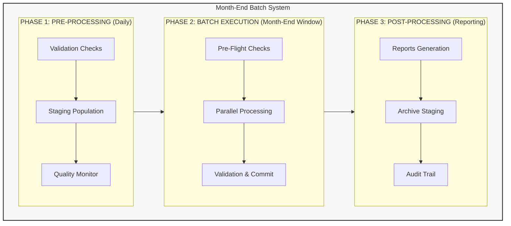
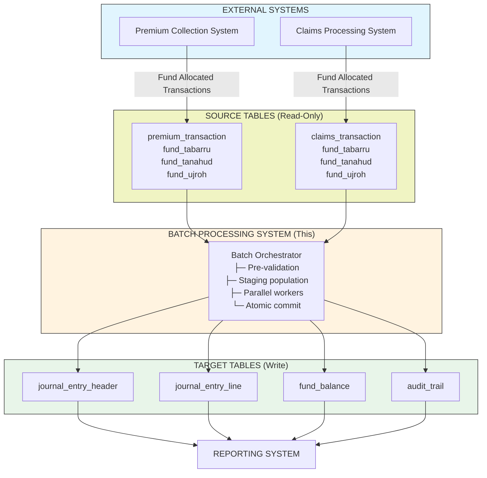
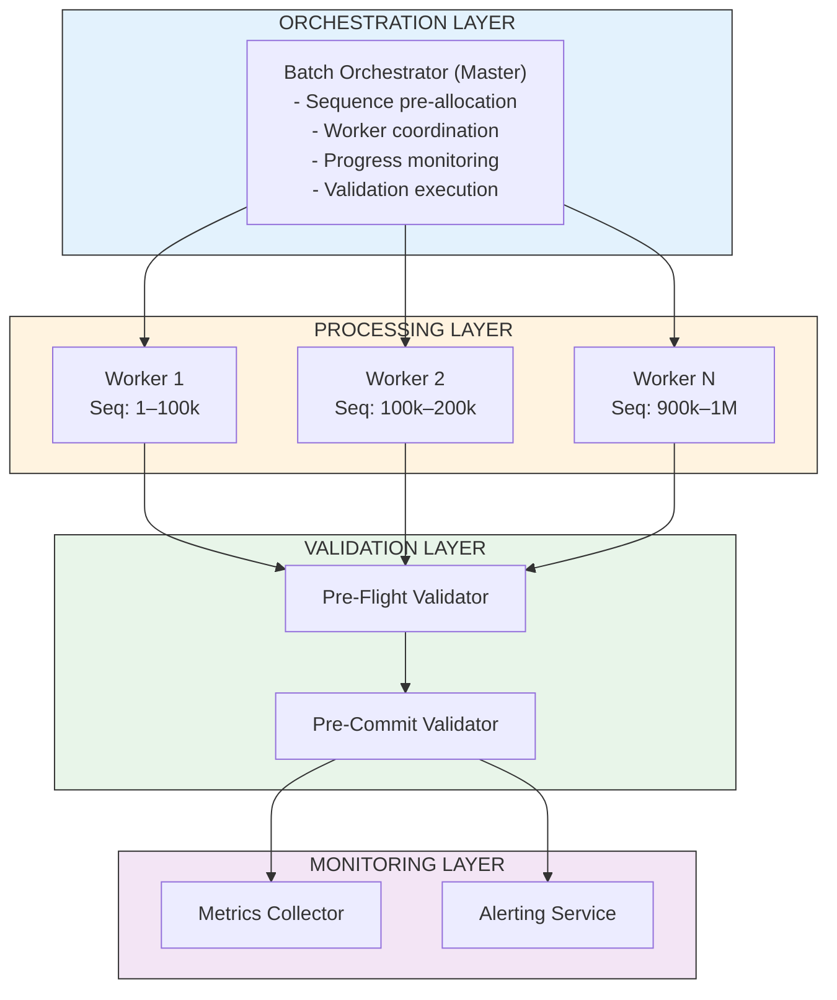
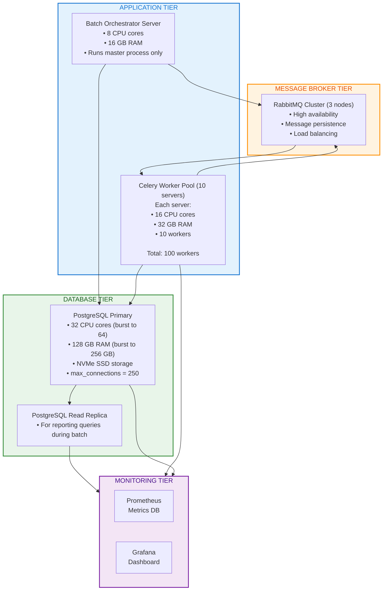
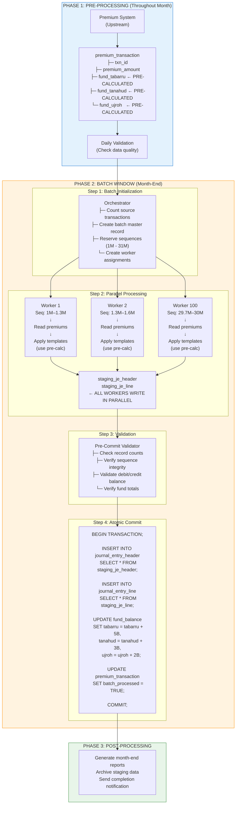
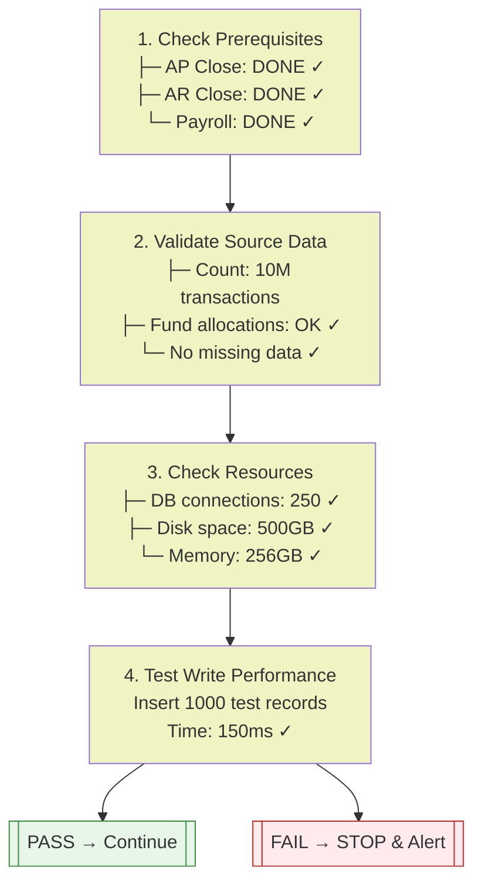

## 1. EXECUTIVE SUMMARY

### 1.1 Purpose

This document describes the technical architecture for a mission-critical batch processing system that generates journal entries for premium and claims transactions during the month-end close window.
### 1.2 Business Requirements
| Requirement | Specification |
| --- | --- |
| Processing Volume | 10M transactions/month (current) → 50M (3 years) |
| Time Window | 2 hours maximum |
| Target Performance | 10M in 20 minutes (100-minute buffer) |
| Failure Tolerance | Zero - mission critical |
| Numbering | Sequential, auditable |
| Processing Order | After AP/AR/Payroll close |

### 1.3 Key Design Decisions

* **Pre-Computation Strategy:** Leverage existing fund allocations in source tables (`premium_transaction`, `claims_transaction`)
* **Staging Pattern:** All computation to staging tables, atomic commit to production
* **Parallel Processing:** 100-200 workers with pre-allocated sequence ranges
* **Validation Gates:** Three-level validation (pre-flight, per-worker, pre-commit)
* **Zero Contention:** Sequence ranges pre-allocated, no database locks during processing

### 1.4 Success Criteria

* ✅ Process 10M transactions in <20 minutes
* ✅ 99.9% success rate
* ✅ Zero data loss or corruption
* ✅ Complete rollback capability
* ✅ Real-time monitoring and alerting
* ✅ Comprehensive audit trail

## 2. SYSTEM OVERVIEW

### 2.1 High-Level Architecture

### 2.2 System Context



### 2.3 Key Assumptions

1. **Source Data Quality:** Premium and claims transactions have valid fund allocations before batch starts  
2. **Sequential Processing:** Batch runs **after** all other month-end processes complete  
3. **Database Availability:** PostgreSQL available throughout the **2-hour window**  
4. **Resource Scaling:** Can temporarily boost database resources during window  
5. **Network Stability:** Low-latency network between workers and database  

---

## 3. ARCHITECTURE DESIGN

### 3.1 Architectural Principles

#### 3.1.1 Core Principles

| Principle        | Implementation                                      |
|------------------|-----------------------------------------------------|
| **Simplicity**   | Single responsibility per component                 |
| **Reliability**  | Multiple validation gates, atomic operations        |
| **Performance**  | Parallel processing, pre-computation                |
| **Observability**| Comprehensive logging and monitoring                |
| **Recoverability**| Staging tables, rollback capability                 |

#### 3.1.2 Design Patterns

1. **Staging Pattern:** All work in staging tables, atomic commit to production  
2. **Worker Pool Pattern:** Fixed pool of workers with pre-assigned work  
3. **Checkpoint Pattern:** Regular progress snapshots for recovery  
4. **Validation Gate Pattern:** Multiple validation layers before commit  
5. **Idempotency Pattern:** Safe to re-run without side effects  

### 3.2 Component Architecture



### 3.3 Technology Stack

| Layer             | Technology             | Justification                                      |
|-------------------|------------------------|----------------------------------------------------|
| **Application**   | Python 3.11+           | Existing codebase, team expertise                  |
| **Web Framework** | Django 4.2+            | ORM, migrations, admin interface                   |
| **Task Queue**    | Celery 5.3+            | Distributed task processing, proven reliability    |
| **Message Broker**| RabbitMQ 3.12+         | Reliable message delivery, clustering support      |
| **Database**      | PostgreSQL 15+         | ACID compliance, partitioning, high performance    |
| **Caching**       | Redis 7.0+             | Result backend for Celery, fast metrics storage    |
| **Monitoring**    | Prometheus + Grafana   | Time-series metrics, rich visualization            |
| **Logging**       | ELK Stack *(optional)* | Centralized logging, powerful search & analysis    |

### 3.4 Deployment Architecture



> **Note:** All components are containerized using Docker and orchestrated via Kubernetes for auto-scaling and resilience.


## 4. DATABASE DESIGN

### 4.1 Source Tables (Read-Only)

#### 4.1.1 Premium Transaction Table

 **Key Insight:** Fund allocations are **already calculated and stored** in the source table.

```sql
-- Existing table (managed by Premium Collection System)
CREATE TABLE premium_transaction (
    txn_id BIGSERIAL PRIMARY KEY,
    policy_id BIGINT NOT NULL REFERENCES policy(policy_id),
    
    -- Transaction details
    txn_date DATE NOT NULL,
    payment_date DATE NOT NULL,
    premium_amount NUMERIC(15,2) NOT NULL,
    
    -- PRE-CALCULATED FUND ALLOCATIONS
    -- These are already computed by premium system!
    fund_tabarru NUMERIC(15,2) NOT NULL,
    fund_tanahud NUMERIC(15,2) NOT NULL,
    fund_ujroh NUMERIC(15,2) NOT NULL,
    
    -- Metadata
    product_code VARCHAR(50) NOT NULL,
    plan_code VARCHAR(50) NOT NULL,
    payment_method VARCHAR(20),
    status VARCHAR(20) NOT NULL,
    
    -- Batch processing tracking
    batch_processed BOOLEAN DEFAULT FALSE,
    batch_id VARCHAR(50),
    je_created_at TIMESTAMP,
    
    created_at TIMESTAMP DEFAULT CURRENT_TIMESTAMP,
    updated_at TIMESTAMP DEFAULT CURRENT_TIMESTAMP,
    
    CONSTRAINT check_fund_allocation 
        CHECK (fund_tabarru + fund_tanahud + fund_ujroh = premium_amount)
);

CREATE INDEX idx_premium_batch_processing 
    ON premium_transaction(batch_processed, txn_date) 
    WHERE batch_processed = FALSE;

CREATE INDEX idx_premium_payment_date 
    ON premium_transaction(payment_date);
```

#### 4.1.2 Claims Transaction Table

```sql
-- Existing table (managed by Claims Processing System)
CREATE TABLE claims_transaction (
    claim_id BIGSERIAL PRIMARY KEY,
    policy_id BIGINT NOT NULL REFERENCES policy(policy_id),
    
    -- Claim details
    claim_date DATE NOT NULL,
    claim_type VARCHAR(50) NOT NULL, -- DEATH, MATURITY, SURRENDER
    claim_amount NUMERIC(15,2) NOT NULL,
    
    -- PRE-CALCULATED FUND ALLOCATIONS
    -- These are already computed by claims system!
    fund_tabarru NUMERIC(15,2) NOT NULL,
    fund_tanahud NUMERIC(15,2) NOT NULL,
    fund_ujroh NUMERIC(15,2) NOT NULL,
    fund_qard_hasan NUMERIC(15,2) DEFAULT 0,
    
    -- Metadata
    product_code VARCHAR(50) NOT NULL,
    status VARCHAR(20) NOT NULL,
    
    -- Batch processing tracking
    batch_processed BOOLEAN DEFAULT FALSE,
    batch_id VARCHAR(50),
    je_created_at TIMESTAMP,
    
    created_at TIMESTAMP DEFAULT CURRENT_TIMESTAMP,
    
    CONSTRAINT check_claim_fund_allocation 
        CHECK (fund_tabarru + fund_tanahud + fund_ujroh + fund_qard_hasan = claim_amount)
);

CREATE INDEX idx_claims_batch_processing 
    ON claims_transaction(batch_processed, claim_date) 
    WHERE batch_processed = FALSE;
```

> **Critical Design Point:** The batch system does **not** calculate fund allocations. It **reads pre-calculated values** and generates accounting entries.

---

### 4.2 Staging Tables

#### 4.2.1 Staging Master Table

```sql
CREATE TABLE staging_month_end_master (
    batch_id VARCHAR(50) PRIMARY KEY,  -- e.g., '2025-01-MONTHEND'
    batch_type VARCHAR(20) NOT NULL,   -- PREMIUM, CLAIMS, COMBINED
    
    -- Scope
    period_start DATE NOT NULL,
    period_end DATE NOT NULL,
    
    -- Source data counts
    source_premium_count BIGINT,
    source_claims_count BIGINT,
    expected_je_count BIGINT,  -- premiums*3 + claims*3
    
    -- Processing state
    status VARCHAR(20) NOT NULL,  -- PREPARING, READY, PROCESSING, VALIDATING, COMMITTED, FAILED
    
    -- Sequence allocation
    sequence_start BIGINT,
    sequence_end BIGINT,
    
    -- Worker allocation
    worker_count INTEGER,
    records_per_worker BIGINT,
    
    -- Timing
    created_at TIMESTAMP DEFAULT CURRENT_TIMESTAMP,
    processing_started_at TIMESTAMP,
    processing_completed_at TIMESTAMP,
    validated_at TIMESTAMP,
    committed_at TIMESTAMP,
    
    -- Results
    actual_je_count BIGINT,
    failed_workers INTEGER DEFAULT 0,
    validation_errors TEXT[],
    
    -- Metadata
    created_by VARCHAR(100) DEFAULT 'SYSTEM',
    notes TEXT
);

CREATE INDEX idx_staging_master_status ON staging_month_end_master(status);
CREATE INDEX idx_staging_master_period ON staging_month_end_master(period_end);
```

#### 4.2.2 Staging Journal Entry Headers

```sql
CREATE TABLE staging_je_header (
    staging_header_id BIGSERIAL PRIMARY KEY,
    batch_id VARCHAR(50) NOT NULL REFERENCES staging_month_end_master(batch_id),
    worker_id INTEGER NOT NULL,
    
    -- Journal entry details (sequence assigned during batch)
    je_number VARCHAR(50),  -- NULL until sequence assigned
    je_sequence BIGINT,     -- Raw sequence number
    je_date DATE NOT NULL,
    je_type VARCHAR(20) NOT NULL,
    
    -- Source linkage
    source_type VARCHAR(20) NOT NULL,  -- PREMIUM, CLAIM
    source_id BIGINT NOT NULL,         -- txn_id or claim_id
    
    -- Template information
    template_code VARCHAR(50) NOT NULL,
    description TEXT,
    
    -- Amounts
    total_debit NUMERIC(15,2) NOT NULL,
    total_credit NUMERIC(15,2) NOT NULL,
    
    -- Processing state
    status VARCHAR(20) DEFAULT 'PENDING',  -- PENDING, VALIDATED, COMMITTED, FAILED
    
    -- Metadata
    created_at TIMESTAMP DEFAULT CURRENT_TIMESTAMP,
    validated_at TIMESTAMP,
    committed_at TIMESTAMP,
    validation_errors TEXT[],
    
    CONSTRAINT check_je_balance CHECK (total_debit = total_credit)
);

-- Partition by worker_id for parallel reads
CREATE INDEX idx_staging_header_worker 
    ON staging_je_header(batch_id, worker_id, status);

CREATE INDEX idx_staging_header_source 
    ON staging_je_header(source_type, source_id);

CREATE INDEX idx_staging_header_sequence 
    ON staging_je_header(je_sequence);
```

#### 4.2.3 Staging Journal Entry Lines

```sql
CREATE TABLE staging_je_line (
    staging_line_id BIGSERIAL PRIMARY KEY,
    staging_header_id BIGINT NOT NULL REFERENCES staging_je_header(staging_header_id),
    batch_id VARCHAR(50) NOT NULL,
    worker_id INTEGER NOT NULL,
    
    -- Line details
    line_number INTEGER NOT NULL,
    account_code VARCHAR(20) NOT NULL,
    fund_type VARCHAR(20) NOT NULL,  -- TABARRU, TANAHUD, UJROH, QARD_HASAN
    
    -- Amounts
    debit_amount NUMERIC(15,2) NOT NULL DEFAULT 0,
    credit_amount NUMERIC(15,2) NOT NULL DEFAULT 0,
    
    -- Description
    description TEXT,
    
    -- Metadata
    created_at TIMESTAMP DEFAULT CURRENT_TIMESTAMP,
    
    CONSTRAINT check_debit_or_credit CHECK (
        (debit_amount > 0 AND credit_amount = 0) OR
        (credit_amount > 0 AND debit_amount = 0)
    )
);

CREATE INDEX idx_staging_line_header 
    ON staging_je_line(staging_header_id);

CREATE INDEX idx_staging_line_worker 
    ON staging_je_line(batch_id, worker_id);

CREATE INDEX idx_staging_line_fund 
    ON staging_je_line(fund_type);
```

---

### 4.3 Production Tables (Write Target)

#### 4.3.1 Journal Entry Header (Production)

```sql
-- Existing production table
CREATE TABLE journal_entry_header (
    je_id BIGSERIAL PRIMARY KEY,
    je_number VARCHAR(50) UNIQUE NOT NULL,
    je_date DATE NOT NULL,
    je_type VARCHAR(20) NOT NULL,
    
    -- Source reference
    reference_type VARCHAR(50),
    reference_id VARCHAR(50),
    
    -- Template
    template_code VARCHAR(50),
    description TEXT,
    
    -- Amounts
    total_debit NUMERIC(15,2) NOT NULL,
    total_credit NUMERIC(15,2) NOT NULL,
    
    -- Status
    status VARCHAR(20) DEFAULT 'POSTED',
    
    -- COA version
    coa_version_id INTEGER REFERENCES chart_of_accounts_version(version_id),
    
    -- Audit
    created_by VARCHAR(100),
    created_at TIMESTAMP DEFAULT CURRENT_TIMESTAMP,
    posted_by VARCHAR(100),
    posted_at TIMESTAMP,
    
    -- Batch tracking
    batch_id VARCHAR(50),
    batch_created_at TIMESTAMP,
    
    CONSTRAINT check_je_balance CHECK (total_debit = total_credit)
);

CREATE UNIQUE INDEX idx_je_number ON journal_entry_header(je_number);
CREATE INDEX idx_je_date ON journal_entry_header(je_date);
CREATE INDEX idx_je_batch ON journal_entry_header(batch_id);
CREATE INDEX idx_je_reference ON journal_entry_header(reference_type, reference_id);
```

#### 4.3.2 Journal Entry Line (Production)

```sql
-- Existing production table
CREATE TABLE journal_entry_line (
    line_id BIGSERIAL PRIMARY KEY,
    je_id BIGINT NOT NULL REFERENCES journal_entry_header(je_id),
    
    -- Line details
    line_number INTEGER NOT NULL,
    account_code VARCHAR(20) NOT NULL,
    fund_type VARCHAR(20) NOT NULL,
    
    -- Amounts
    debit_amount NUMERIC(15,2) NOT NULL DEFAULT 0,
    credit_amount NUMERIC(15,2) NOT NULL DEFAULT 0,
    
    -- Description
    description TEXT,
    
    -- Source reference
    reference_type VARCHAR(50),
    reference_id VARCHAR(50),
    
    CONSTRAINT check_line_debit_or_credit CHECK (
        (debit_amount > 0 AND credit_amount = 0) OR
        (credit_amount > 0 AND debit_amount = 0)
    )
);

CREATE INDEX idx_je_line_je ON journal_entry_line(je_id);
CREATE INDEX idx_je_line_account ON journal_entry_line(account_code);
CREATE INDEX idx_je_line_fund ON journal_entry_line(fund_type);
```

---

### 4.4 Control & Monitoring Tables

#### 4.4.1 Worker Control Table

```sql
CREATE TABLE batch_worker_control (
    worker_id INTEGER PRIMARY KEY,
    batch_id VARCHAR(50) NOT NULL REFERENCES staging_month_end_master(batch_id),
    
    -- Worker assignment
    sequence_start BIGINT NOT NULL,
    sequence_end BIGINT NOT NULL,
    
    -- Source data range
    source_record_start BIGINT,
    source_record_end BIGINT,
    expected_record_count BIGINT,
    
    -- Processing state
    status VARCHAR(20) NOT NULL,  -- ASSIGNED, RUNNING, COMPLETED, FAILED
    
    -- Progress tracking
    records_processed BIGINT DEFAULT 0,
    je_created_count BIGINT DEFAULT 0,
    last_checkpoint_at TIMESTAMP,
    last_source_id_processed BIGINT,
    
    -- Timing
    started_at TIMESTAMP,
    completed_at TIMESTAMP,
    elapsed_seconds INTEGER,
    
    -- Performance
    records_per_second NUMERIC(10,2),
    
    -- Error tracking
    error_count INTEGER DEFAULT 0,
    last_error TEXT,
    last_error_at TIMESTAMP,
    
    -- Metadata
    hostname VARCHAR(100),
    process_id INTEGER
);

CREATE INDEX idx_worker_batch_status 
    ON batch_worker_control(batch_id, status);
```

#### 4.4.2 Processing Checkpoints

```sql
CREATE TABLE batch_processing_checkpoint (
    checkpoint_id BIGSERIAL PRIMARY KEY,
    batch_id VARCHAR(50) NOT NULL,
    worker_id INTEGER NOT NULL,
    
    -- Checkpoint data
    records_processed BIGINT NOT NULL,
    last_source_id BIGINT NOT NULL,
    last_sequence_used BIGINT NOT NULL,
    
    -- Performance at checkpoint
    elapsed_seconds INTEGER NOT NULL,
    records_per_second NUMERIC(10,2),
    
    -- ETA calculation
    remaining_records BIGINT,
    eta_seconds INTEGER,
    
    -- Timestamp
    checkpoint_at TIMESTAMP DEFAULT CURRENT_TIMESTAMP,
    
    FOREIGN KEY (worker_id, batch_id) 
        REFERENCES batch_worker_control(worker_id, batch_id)
);

CREATE INDEX idx_checkpoint_worker 
    ON batch_processing_checkpoint(batch_id, worker_id, checkpoint_at);
```

#### 4.4.3 Validation Results Table

```sql
CREATE TABLE batch_validation_results (
    validation_id BIGSERIAL PRIMARY KEY,
    batch_id VARCHAR(50) NOT NULL REFERENCES staging_month_end_master(batch_id),
    
    -- Validation metadata
    validation_type VARCHAR(50) NOT NULL,  -- PRE_FLIGHT, PER_WORKER, PRE_COMMIT
    validation_name VARCHAR(100) NOT NULL,
    
    -- Result
    status VARCHAR(20) NOT NULL,  -- PASS, FAIL, WARNING
    
    -- Details
    expected_value TEXT,
    actual_value TEXT,
    difference TEXT,
    error_message TEXT,
    
    -- Timestamp
    validated_at TIMESTAMP DEFAULT CURRENT_TIMESTAMP,
    
    -- Context
    worker_id INTEGER,
    validation_data JSONB
);

CREATE INDEX idx_validation_batch 
    ON batch_validation_results(batch_id, validation_type, status);
```

---

### 4.5 Sequence Management

#### 4.5.1 Sequence Generator

```sql
-- Existing sequence
CREATE SEQUENCE journal_entry_number_seq
    START WITH 1
    INCREMENT BY 1
    NO MAXVALUE
    CACHE 1;

-- Batch sequence reservation function
CREATE OR REPLACE FUNCTION reserve_je_sequence_range(range_size BIGINT)
RETURNS TABLE(start_seq BIGINT, end_seq BIGINT) AS $$
DECLARE
    start_value BIGINT;
    end_value BIGINT;
BEGIN
    -- Atomically advance sequence by range_size
    SELECT NEXTVAL('journal_entry_number_seq') INTO start_value;
    
    -- Advance to end of range
    PERFORM SETVAL('journal_entry_number_seq', 
                   start_value + range_size - 1, 
                   TRUE);
    
    end_value := start_value + range_size - 1;
    
    -- Log reservation for audit
    INSERT INTO sequence_reservation_log (
        start_seq,
        end_seq,
        range_size,
        reserved_at
    ) VALUES (
        start_value,
        end_value,
        range_size,
        CURRENT_TIMESTAMP
    );
    
    RETURN QUERY SELECT start_value, end_value;
END;
$$ LANGUAGE plpgsql;

-- Audit table for sequence reservations
CREATE TABLE sequence_reservation_log (
    reservation_id BIGSERIAL PRIMARY KEY,
    start_seq BIGINT NOT NULL,
    end_seq BIGINT NOT NULL,
    range_size BIGINT NOT NULL,
    batch_id VARCHAR(50),
    reserved_at TIMESTAMP DEFAULT CURRENT_TIMESTAMP
);

CREATE INDEX idx_seq_reservation_batch ON sequence_reservation_log(batch_id);
```

---

### 4.6 Data Migration Strategy

```sql
-- Migration to add batch tracking to existing tables
ALTER TABLE premium_transaction 
    ADD COLUMN IF NOT EXISTS batch_processed BOOLEAN DEFAULT FALSE,
    ADD COLUMN IF NOT EXISTS batch_id VARCHAR(50),
    ADD COLUMN IF NOT EXISTS je_created_at TIMESTAMP;

ALTER TABLE claims_transaction 
    ADD COLUMN IF NOT EXISTS batch_processed BOOLEAN DEFAULT FALSE,
    ADD COLUMN IF NOT EXISTS batch_id VARCHAR(50),
    ADD COLUMN IF NOT EXISTS je_created_at TIMESTAMP;

-- Create indexes for batch processing
CREATE INDEX IF NOT EXISTS idx_premium_batch_unprocessed 
    ON premium_transaction(payment_date) 
    WHERE batch_processed = FALSE;

CREATE INDEX IF NOT EXISTS idx_claims_batch_unprocessed 
    ON claims_transaction(claim_date) 
    WHERE batch_processed = FALSE;

-- Backfill existing data
UPDATE premium_transaction 
SET batch_processed = TRUE,
    batch_id = 'PRE-MIGRATION'
WHERE je_created_at IS NOT NULL;

UPDATE claims_transaction 
SET batch_processed = TRUE,
    batch_id = 'PRE-MIGRATION'
WHERE je_created_at IS NOT NULL;
```


## 5. COMPONENT SPECIFICATIONS

### 5.1 Batch Orchestrator (Master Component)

#### 5.1.1 Responsibilities

**Batch Initialization**  
- Create `batch_id` and master record  
- Count source transactions  
- Calculate expected JE count  
- Pre-allocate sequence ranges  

**Worker Coordination**  
- Divide work into worker assignments  
- Launch Celery workers  
- Monitor worker progress  
- Handle worker failures  

**Validation Execution**  
- Run pre-flight checks  
- Coordinate per-worker validation  
- Execute pre-commit validation  

**Atomic Commit**  
- Coordinate final commit  
- Update source tables  
- Archive staging data  

---

#### 5.1.2 Class Structure

```python
class BatchOrchestrator:
    """
    Master controller for month-end batch processing
    """
    
    def __init__(self, batch_id: str, period_start: date, period_end: date):
        self.batch_id = batch_id
        self.period_start = period_start
        self.period_end = period_end
        self.master_record = None
        self.worker_count = 100  # Configurable
        
    def execute_batch(self) -> BatchResult:
        """
        Main execution flow
        """
        try:
            # Phase 1: Preparation
            self.create_master_record()
            self.run_pre_flight_validation()
            self.prepare_staging_data()
            
            # Phase 2: Sequence allocation
            sequence_range = self.allocate_sequence_range()
            worker_assignments = self.create_worker_assignments(sequence_range)
            
            # Phase 3: Parallel processing
            self.launch_workers(worker_assignments)
            self.monitor_progress()
            
            # Phase 4: Validation
            self.validate_worker_results()
            self.run_pre_commit_validation()
            
            # Phase 5: Commit
            self.atomic_commit()
            self.update_source_tables()
            
            # Phase 6: Cleanup
            self.archive_staging_data()
            self.generate_reports()
            
            return BatchResult(status='SUCCESS', batch_id=self.batch_id)
            
        except Exception as e:
            self.handle_failure(e)
            raise
    
    def create_master_record(self):
        """Create batch master record"""
        # Count source transactions
        premium_count = self.count_unprocessed_premiums()
        claims_count = self.count_unprocessed_claims()
        expected_je = (premium_count + claims_count) * 3
        
        self.master_record = StagingMonthEndMaster.objects.create(
            batch_id=self.batch_id,
            batch_type='COMBINED',
            period_start=self.period_start,
            period_end=self.period_end,
            source_premium_count=premium_count,
            source_claims_count=claims_count,
            expected_je_count=expected_je,
            status='PREPARING',
            worker_count=self.worker_count
        )
    
    def run_pre_flight_validation(self):
        """Execute pre-flight checks"""
        validator = PreFlightValidator(self.batch_id)
        results = validator.validate_all()
        
        if not results.all_passed():
            raise BatchValidationError(
                f"Pre-flight validation failed: {results.failures}"
            )
    
    def allocate_sequence_range(self) -> SequenceRange:
        """Pre-allocate all sequences for batch"""
        total_je_count = self.master_record.expected_je_count
        
        with connection.cursor() as cursor:
            cursor.execute(
                "SELECT * FROM reserve_je_sequence_range(%s)",
                [total_je_count]
            )
            start_seq, end_seq = cursor.fetchone()
        
        # Update master record
        self.master_record.sequence_start = start_seq
        self.master_record.sequence_end = end_seq
        self.master_record.save()
        
        return SequenceRange(start=start_seq, end=end_seq)
    
    def create_worker_assignments(self, sequence_range: SequenceRange) -> List[WorkerAssignment]:
        """Divide work among workers"""
        total_transactions = (
            self.master_record.source_premium_count + 
            self.master_record.source_claims_count
        )
        records_per_worker = total_transactions // self.worker_count
        
        assignments = []
        current_seq = sequence_range.start
        
        for worker_id in range(self.worker_count):
            # Calculate this worker's source data range
            source_start = worker_id * records_per_worker
            source_end = (worker_id + 1) * records_per_worker
            
            # Calculate sequence range (3 JEs per transaction)
            sequences_needed = (source_end - source_start) * 3
            seq_start = current_seq
            seq_end = current_seq + sequences_needed - 1
            
            assignment = WorkerAssignment(
                worker_id=worker_id,
                batch_id=self.batch_id,
                sequence_start=seq_start,
                sequence_end=seq_end,
                source_record_start=source_start,
                source_record_end=source_end
            )
            assignments.append(assignment)
            
            # Create control record
            BatchWorkerControl.objects.create(
                worker_id=worker_id,
                batch_id=self.batch_id,
                sequence_start=seq_start,
                sequence_end=seq_end,
                source_record_start=source_start,
                source_record_end=source_end,
                expected_record_count=source_end - source_start,
                status='ASSIGNED'
            )
            
            current_seq = seq_end + 1
        
        return assignments
    
    def launch_workers(self, assignments: List[WorkerAssignment]):
        """Launch Celery workers"""
        from .tasks import process_batch_worker
        
        # Launch all workers asynchronously
        async_results = []
        for assignment in assignments:
            result = process_batch_worker.delay(
                batch_id=self.batch_id,
                worker_id=assignment.worker_id,
                sequence_start=assignment.sequence_start,
                sequence_end=assignment.sequence_end,
                source_start=assignment.source_record_start,
                source_end=assignment.source_record_end
            )
            async_results.append(result)
        
        self.master_record.status = 'PROCESSING'
        self.master_record.processing_started_at = datetime.utcnow()
        self.master_record.save()
        
        return async_results
    
    def monitor_progress(self):
        """Monitor worker progress in real-time"""
        monitor = ProgressMonitor(self.batch_id)
        
        while not monitor.is_complete():
            time.sleep(5)  # Check every 5 seconds
            
            status = monitor.get_current_status()
            
            # Log progress
            logger.info(
                f"Batch {self.batch_id}: "
                f"{status.completed_workers}/{status.total_workers} workers complete, "
                f"{status.progress_percentage:.1f}% done, "
                f"ETA: {status.eta_minutes} minutes"
            )
            
            # Check for failures
            if status.failed_workers > 0:
                self.handle_worker_failures(status.failed_worker_ids)
            
            # Check if falling behind schedule
            if status.eta_minutes > self.deadline_minutes:
                self.alert_falling_behind(status)
    
    def atomic_commit(self):
        """Commit all data to production in single transaction"""
        with transaction.atomic():
            # Insert journal entry headers
            self.bulk_insert_je_headers()
            
            # Insert journal entry lines
            self.bulk_insert_je_lines()
            
            # Update fund balances
            self.update_fund_balances()
            
            # Update source tables
            self.mark_source_transactions_processed()
            
            # Update master record
            self.master_record.status = 'COMMITTED'
            self.master_record.committed_at = datetime.utcnow()
            self.master_record.save()
```

5.2 Batch Worker Component
> 5.2.1 Responsibilities

> 1. Data Reading: Read assigned range from source tables
> 2. JE Generation: Apply templates to create journal entries
> 3. Staging Write: Write to staging tables
> 4. Progress Reporting: Regular checkpoints
> 5. Error Handling: Log errors, continue processing

5.2.2 Worker Implementation
```python
class BatchWorker:
    """
    Individual worker process for batch processing
    """
    
    def __init__(self, worker_id: int, batch_id: str, 
                 sequence_start: int, sequence_end: int,
                 source_start: int, source_end: int):
        self.worker_id = worker_id
        self.batch_id = batch_id
        self.sequence_current = sequence_start
        self.sequence_end = sequence_end
        self.source_start = source_start
        self.source_end = source_end
        self.control_record = None
        self.je_service = JournalEntryService()
        
    def execute(self) -> WorkerResult:
        """Main worker execution"""
        try:
            # Initialize
            self.initialize_worker()
            
            # Process premium transactions
            premium_results = self.process_premium_transactions()
            
            # Process claims transactions
            claims_results = self.process_claims_transactions()
            
            # Finalize
            self.finalize_worker()
            
            return WorkerResult(
                status='SUCCESS',
                worker_id=self.worker_id,
                records_processed=premium_results.count + claims_results.count,
                je_created=premium_results.je_count + claims_results.je_count
            )
            
        except Exception as e:
            self.handle_worker_failure(e)
            raise
    
    def initialize_worker(self):
        """Initialize worker control record"""
        self.control_record = BatchWorkerControl.objects.get(
            batch_id=self.batch_id,
            worker_id=self.worker_id
        )
        
        self.control_record.status = 'RUNNING'
        self.control_record.started_at = datetime.utcnow()
        self.control_record.hostname = socket.gethostname()
        self.control_record.process_id = os.getpid()
        self.control_record.save()
    
    def process_premium_transactions(self) -> ProcessingResult:
        """Process premium transactions in assigned range"""
        
        # Query premium transactions with FUND ALLOCATIONS ALREADY DONE
        premiums = PremiumTransaction.objects.filter(
            batch_processed=False,
            payment_date__range=(self.period_start, self.period_end)
        ).order_by('txn_id')[self.source_start:self.source_end]
        
        je_headers = []
        je_lines = []
        records_processed = 0
        
        for premium in premiums:
            try:
                # Generate 3 journal entries for this premium
                # Fund allocations already in premium.fund_tabarru, premium.fund_tanahud, premium.fund_ujroh
                entries = self.generate_premium_journal_entries(premium)
                
                # Add to staging with assigned sequences
                for entry in entries:
                    je_headers.append(
                        self.create_staging_header(entry, premium)
                    )
                    je_lines.extend(
                        self.create_staging_lines(entry)
                    )
                    self.sequence_current += 1
                
                records_processed += 1
                
                # Checkpoint every 1000 records
                if records_processed % 1000 == 0:
                    self.checkpoint(records_processed, premium.txn_id)
                
            except Exception as e:
                logger.error(
                    f"Worker {self.worker_id}: Error processing premium {premium.txn_id}: {e}"
                )
                self.control_record.error_count += 1
                self.control_record.last_error = str(e)
                self.control_record.save()
        
        # Bulk insert to staging
        StagingJEHeader.objects.bulk_create(je_headers, batch_size=1000)
        StagingJELine.objects.bulk_create(je_lines, batch_size=5000)
        
        return ProcessingResult(
            count=records_processed,
            je_count=len(je_headers)
        )
    
    def generate_premium_journal_entries(self, premium: PremiumTransaction) -> List[Dict]:
        """
        Generate journal entries for premium
        
        KEY: Fund allocations already calculated in source table!
        No need to query allocation rules or do calculations.
        """
        entries = []
        
        # Entry 1: Receipt of Premium (Bank DR, Liability CR)
        entries.append({
            'description': f'Premium receipt - Policy {premium.policy_id}',
            'lines': [
                {
                    'line_number': 1,
                    'account_code': '1010-001',  # Bank
                    'fund_type': 'OPERATOR',
                    'debit_amount': premium.premium_amount,
                    'credit_amount': 0
                },
                {
                    'line_number': 2,
                    'account_code': '2010-001',  # Premium Liability
                    'fund_type': 'OPERATOR',
                    'debit_amount': 0,
                    'credit_amount': premium.premium_amount
                }
            ]
        })
        
        # Entry 2: Allocation to Tabarru Fund
        entries.append({
            'description': f'Tabarru allocation - Policy {premium.policy_id}',
            'lines': [
                {
                    'line_number': 1,
                    'account_code': '2010-001',  # Premium Liability
                    'fund_type': 'OPERATOR',
                    'debit_amount': premium.fund_tabarru,  # ← Already calculated!
                    'credit_amount': 0
                },
                {
                    'line_number': 2,
                    'account_code': '3010-001',  # Tabarru Fund
                    'fund_type': 'TABARRU',
                    'debit_amount': 0,
                    'credit_amount': premium.fund_tabarru  # ← Already calculated!
                }
            ]
        })
        
        # Entry 3: Allocation to Tanahud Fund
        entries.append({
            'description': f'Tanahud allocation - Policy {premium.policy_id}',
            'lines': [
                {
                    'line_number': 1,
                    'account_code': '2010-001',  # Premium Liability
                    'fund_type': 'OPERATOR',
                    'debit_amount': premium.fund_tanahud,  # ← Already calculated!
                    'credit_amount': 0
                },
                {
                    'line_number': 2,
                    'account_code': '3020-001',  # Tanahud Fund
                    'fund_type': 'TANAHUD',
                    'debit_amount': 0,
                    'credit_amount': premium.fund_tanahud  # ← Already calculated!
                }
            ]
        })
        
        # Note: Ujroh remains in OPERATOR fund (no separate entry needed)
        
        return entries
    
    def create_staging_header(self, entry: Dict, source_txn) -> StagingJEHeader:
        """Create staging header record"""
        
        je_date = source_txn.payment_date
        template_code = 'PREMIUM_RECEIPT'
        prefix = f'JE-{template_code[:4]}-{je_date.strftime("%Y%m%d")}-'
        
        return StagingJEHeader(
            batch_id=self.batch_id,
            worker_id=self.worker_id,
            je_sequence=self.sequence_current,
            je_number=f'{prefix}{self.sequence_current:010d}',  # Full JE number
            je_date=je_date,
            je_type='PREMIUM',
            source_type='PREMIUM',
            source_id=source_txn.txn_id,
            template_code=template_code,
            description=entry['description'],
            total_debit=sum(line['debit_amount'] for line in entry['lines']),
            total_credit=sum(line['credit_amount'] for line in entry['lines']),
            status='PENDING'
        )
    
    def checkpoint(self, records_processed: int, last_source_id: int):
        """Save checkpoint for recovery"""
        elapsed = (datetime.utcnow() - self.control_record.started_at).total_seconds()
        rate = records_processed / elapsed if elapsed > 0 else 0
        
        # Update control record
        self.control_record.records_processed = records_processed
        self.control_record.last_source_id_processed = last_source_id
        self.control_record.last_checkpoint_at = datetime.utcnow()
        self.control_record.records_per_second = rate
        self.control_record.save()
        
        # Save detailed checkpoint
        remaining = self.control_record.expected_record_count - records_processed
        eta = remaining / rate if rate > 0 else 0
        
        BatchProcessingCheckpoint.objects.create(
            batch_id=self.batch_id,
            worker_id=self.worker_id,
            records_processed=records_processed,
            last_source_id=last_source_id,
            last_sequence_used=self.sequence_current,
            elapsed_seconds=int(elapsed),
            records_per_second=rate,
            remaining_records=remaining,
            eta_seconds=int(eta)
        )
5.3 Validation Components
5.3.1 Pre-Flight Validator
pythonclass PreFlightValidator:
    """
    Validates environment before batch starts
    """
    
    def __init__(self, batch_id: str):
        self.batch_id = batch_id
        self.results = []
        
    def validate_all(self) -> ValidationResults:
        """Run all pre-flight checks"""
        
        self.check_prerequisite_batches()
        self.check_source_data_integrity()
        self.check_database_resources()
        self.check_sequence_generator()
        self.check_staging_tables()
        
        return ValidationResults(self.results)
    
    def check_prerequisite_batches(self):
        """Verify AP/AR/Payroll batches completed"""
        # Check that other month-end processes finished
        prerequisite_batches = ['AP_CLOSE', 'AR_CLOSE', 'PAYROLL_CLOSE']
        
        for batch_type in prerequisite_batches:
            status = get_batch_status(batch_type, self.period_end)
            
            if status != 'COMPLETED':
                self.results.append(ValidationResult(
                    validation_name='prerequisite_batch_check',
                    status='FAIL',
                    error_message=f'{batch_type} not completed'
                ))
    
    def check_source_data_integrity(self):
        """Validate source transactions"""
        
        # Check 1: All premiums have fund allocations
        invalid_premiums = PremiumTransaction.objects.filter(
            batch_processed=False,
            payment_date__range=(self.period_start, self.period_end)
        ).exclude(
            fund_tabarru__gt=0,
            fund_tanahud__gt=0,
            fund_ujroh__gt=0
        ).count()
        
        if invalid_premiums > 0:
            self.results.append(ValidationResult(
                validation_name='premium_fund_allocation',
                status='FAIL',
                error_message=f'{invalid_premiums} premiums missing fund allocations'
            ))
        
        # Check 2: Fund allocations sum to premium amount
        invalid_sums = PremiumTransaction.objects.filter(
            batch_processed=False,
            payment_date__range=(self.period_start, self.period_end)
        ).annotate(
            fund_sum=F('fund_tabarru') + F('fund_tanahud') + F('fund_ujroh')
        ).exclude(
            fund_sum=F('premium_amount')
        ).count()
        
        if invalid_sums > 0:
            self.results.append(ValidationResult(
                validation_name='premium_allocation_sum',
                status='FAIL',
                error_message=f'{invalid_sums} premiums with invalid fund allocation sums'
            ))
5.3.2 Pre-Commit Validator
pythonclass PreCommitValidator:
    """
    Validates staged data before committing to production
    """
    
    def __init__(self, batch_id: str):
        self.batch_id = batch_id
        self.results = []
    
    def validate_all(self) -> ValidationResults:
        """Run all pre-commit validations"""
        
        self.validate_record_counts()
        self.validate_sequence_integrity()
        self.validate_debit_credit_balance()
        self.validate_fund_totals()
        self.validate_source_linkage()
        
        return ValidationResults(self.results)
    
    def validate_record_counts(self):
        """Verify expected number of records"""
        
        master = StagingMonthEndMaster.objects.get(batch_id=self.batch_id)
        
        actual_headers = StagingJEHeader.objects.filter(
            batch_id=self.batch_id
        ).count()
        
        expected_headers = master.expected_je_count
        
        if actual_headers != expected_headers:
            self.results.append(ValidationResult(
                validation_name='record_count_check',
                status='FAIL',
                expected_value=str(expected_headers),
                actual_value=str(actual_headers),
                error_message=f'Expected {expected_headers} JE headers, got {actual_headers}'
            ))
    
    def validate_sequence_integrity(self):
        """Check for sequence gaps or duplicates"""
        
        sequences = StagingJEHeader.objects.filter(
            batch_id=self.batch_id
        ).values_list('je_sequence', flat=True).order_by('je_sequence')
        
        sequences_list = list(sequences)
        
        # Check for duplicates
        if len(sequences_list) != len(set(sequences_list)):
            self.results.append(ValidationResult(
                validation_name='sequence_duplicate_check',
                status='FAIL',
                error_message='Duplicate sequences detected'
            ))
        
        # Check for gaps
        expected_range = range(sequences_list[0], sequences_list[-1] + 1)
        missing = set(expected_range) - set(sequences_list)
        
        if missing:
            self.results.append(ValidationResult(
                validation_name='sequence_gap_check',
                status='FAIL',
                error_message=f'Missing sequences: {list(missing)[:10]}...'
            ))
    
    def validate_debit_credit_balance(self):
        """Verify global debit/credit balance"""
        
        totals = StagingJEHeader.objects.filter(
            batch_id=self.batch_id
        ).aggregate(
            total_debit=Sum('total_debit'),
            total_credit=Sum('total_credit')
        )
        
        if totals['total_debit'] != totals['total_credit']:
            self.results.append(ValidationResult(
                validation_name='debit_credit_balance',
                status='FAIL',
                expected_value=str(totals['total_debit']),
                actual_value=str(totals['total_credit']),
                difference=str(totals['total_debit'] - totals['total_credit']),
                error_message='Total debits do not equal total credits'
            ))
    
    def validate_fund_totals(self):
        """Verify fund balance changes match source transactions"""
        
        master = StagingMonthEndMaster.objects.get(batch_id=self.batch_id)
        
        # Calculate expected fund changes from source
        premium_totals = PremiumTransaction.objects.filter(
            payment_date__range=(self.period_start, self.period_end),
            batch_processed=False
        ).aggregate(
            tabarru=Sum('fund_tabarru'),
            tanahud=Sum('fund_tanahud'),
            ujroh=Sum('fund_ujroh')
        )
        
        # Calculate actual fund changes from staged JEs
        staged_totals = StagingJELine.objects.filter(
            batch_id=self.batch_id
        ).values('fund_type').annotate(
            total_credit=Sum('credit_amount'),
            total_debit=Sum('debit_amount')
        )
        
        # Compare (detailed validation logic)
        for fund_type in ['TABARRU', 'TANAHUD', 'UJROH']:
            expected = premium_totals.get(fund_type.lower(), 0)
            staged = next(
                (item for item in staged_totals if item['fund_type'] == fund_type),
                None
            )
            
            if staged:
                actual = staged['total_credit'] - staged['total_debit']
                if abs(float(expected) - float(actual)) > 0.01:  # Allow 1 cent tolerance
                    self.results.append(ValidationResult(
                        validation_name=f'fund_total_{fund_type}',
                        status='FAIL',
                        expected_value=str(expected),
                        actual_value=str(actual),
                        error_message=f'{fund_type} fund total mismatch'
                    ))
```


# 6. DATA FLOW & PROCESSING

## 6.1 Overall Data Flow



## 6.2 Detailed Processing Flow

### 6.2.1 Pre-Flight Checks (2 minutes)


6.2.2 Sequence Allocation (30 seconds)
```sql
-- Single atomic call to reserve entire range
SELECT * FROM reserve_je_sequence_range(30000000);  -- 10M txns × 3 JEs

Returns:
  start_seq: 50,000,001
  end_seq:   80,000,000

-- This takes ~30 seconds for logging and validation
-- But guarantees NO conflicts during parallel processing
```

### 6.2.3 Worker Assignment (1 minute)
```
Total Transactions: 10,000,000
Workers: 100
Records per worker: 100,000

Worker Assignments:
┌──────────┬─────────────────┬──────────────────┐
│ Worker   │ Source Range    │ Sequence Range   │
├──────────┼─────────────────┼──────────────────┤
│ 1        │ 0 - 100,000     │ 50,000,001 -     │
│          │                 │ 50,300,000       │
├──────────┼─────────────────┼──────────────────┤
│ 2        │ 100,000-200,000 │ 50,300,001 -     │
│          │                 │ 50,600,000       │
├──────────┼─────────────────┼──────────────────┤
│ ...      │ ...             │ ...              │
├──────────┼─────────────────┼──────────────────┤
│ 100      │ 9,900,000 -     │ 79,700,001 -     │
│          │ 10,000,000      │ 80,000,000       │
└──────────┴─────────────────┴──────────────────┘

Key: NO OVERLAP between workers!
     Each worker has EXCLUSIVE sequence range
     NO database contention during processing
```

### 6.2.4 Parallel Processing (10-12 minutes)
```
Each Worker Process:
┌────────────────────────────────────────────┐
│ Worker N (processes 100k transactions)     │
├────────────────────────────────────────────┤
│                                            │
│  FOR EACH premium IN source_range:         │
│    │                                       │
│    ├─ Read premium data                   │
│    │  ├─ txn_id: 12345                    │
│    │  ├─ amount: 1,000,000                │
│    │  ├─ fund_tabarru: 400,000 ← exists! │
│    │  ├─ fund_tanahud: 400,000 ← exists! │
│    │  └─ fund_ujroh: 200,000   ← exists! │
│    │                                       │
│    ├─ Apply Template (NO calculation!)    │
│    │  └─ Just map pre-calculated values   │
│    │                                       │
│    ├─ Generate 3 JEs                      │
│    │  ├─ JE 1: Receipt (Bank DR, Liab CR) │
│    │  ├─ JE 2: Tabarru (use 400,000)     │
│    │  └─ JE 3: Tanahud (use 400,000)     │
│    │                                       │
│    ├─ Assign sequences (from range)       │
│    │  ├─ JE 1: seq 50,000,001             │
│    │  ├─ JE 2: seq 50,000,002             │
│    │  └─ JE 3: seq 50,000,003             │
│    │                                       │
│    └─ Write to staging (batch of 1000)   │
│                                            │
│  Checkpoint every 1000 records             │
│  Report progress to master                 │
│                                            │
│  Time: ~10 minutes for 100k records       │
│  (720 records/sec per worker)              │
│                                            │
└────────────────────────────────────────────┘

All 100 workers run in parallel
No database conflicts (exclusive sequences)
Total time: ~10-12 minutes for 10M transactions
```
### 6.2.5 Validation (2-3 minutes)

```sql
-- Validation Query 1: Record Count
SELECT 
    COUNT(*) as actual_count,
    30000000 as expected_count,
    COUNT(*) = 30000000 as match
FROM staging_je_header
WHERE batch_id = '2025-01-MONTHEND';

-- Validation Query 2: Sequence Integrity
WITH sequence_check AS (
    SELECT 
        je_sequence,
        LAG(je_sequence) OVER (ORDER BY je_sequence) as prev_seq
    FROM staging_je_header
    WHERE batch_id = '2025-01-MONTHEND'
)
SELECT COUNT(*) as gap_count
FROM sequence_check
WHERE je_sequence - prev_seq > 1;
-- Should return 0

-- Validation Query 3: Debit/Credit Balance
SELECT 
    SUM(total_debit) as total_debit,
    SUM(total_credit) as total_credit,
    SUM(total_debit) - SUM(total_credit) as difference
FROM staging_je_header
WHERE batch_id = '2025-01-MONTHEND';
-- Difference should be 0.00

-- Validation Query 4: Fund Totals
SELECT 
    fund_type,
    SUM(credit_amount) - SUM(debit_amount) as net_change
FROM staging_je_line
WHERE batch_id = '2025-01-MONTHEND'
GROUP BY fund_type;

-- Compare with source:
SELECT 
    'TABARRU' as fund_type,
    SUM(fund_tabarru) as expected_change
FROM premium_transaction
WHERE payment_date BETWEEN '2025-01-01' AND '2025-01-31'
  AND batch_processed = FALSE
UNION ALL
SELECT 
    'TANAHUD' as fund_type,
    SUM(fund_tanahud) as expected_change
FROM premium_transaction
WHERE payment_date BETWEEN '2025-01-01' AND '2025-01-31'
  AND batch_processed = FALSE;
6.2.6 Atomic Commit (3-5 minutes)
sql-- CRITICAL: All-or-nothing commit
BEGIN TRANSACTION;

-- Step 1: Insert journal entry headers (30M records)
INSERT INTO journal_entry_header (
    je_number, je_date, je_type, reference_type, reference_id,
    description, total_debit, total_credit, status,
    coa_version_id, template_code, created_by, posted_by, posted_at,
    batch_id, batch_created_at
)
SELECT 
    je_number, je_date, je_type, source_type, source_id,
    description, total_debit, total_credit, 'POSTED',
    1, template_code, 'BATCH_SYSTEM', 'BATCH_SYSTEM', CURRENT_TIMESTAMP,
    batch_id, CURRENT_TIMESTAMP
FROM staging_je_header
WHERE batch_id = '2025-01-MONTHEND'
  AND status = 'VALIDATED';
-- Time: ~2 minutes

-- Step 2: Insert journal entry lines (90M records = 30M headers × 3 lines avg)
INSERT INTO journal_entry_line (
    je_id, line_number, account_code, fund_type,
    debit_amount, credit_amount, description
)
SELECT 
    jeh.je_id,
    sl.line_number,
    sl.account_code,
    sl.fund_type,
    sl.debit_amount,
    sl.credit_amount,
    sl.description
FROM staging_je_line sl
JOIN staging_je_header sh ON sl.staging_header_id = sh.staging_header_id
JOIN journal_entry_header jeh ON sh.je_number = jeh.je_number
WHERE sl.batch_id = '2025-01-MONTHEND';
-- Time: ~3 minutes (larger dataset)

-- Step 3: Update fund balances (atomic)
UPDATE fund_balance
SET 
    current_balance = current_balance + fund_changes.net_change,
    last_updated = CURRENT_TIMESTAMP,
    updated_by = 'BATCH_SYSTEM'
FROM (
    SELECT 
        fund_type,
        SUM(credit_amount) - SUM(debit_amount) as net_change
    FROM journal_entry_line
    WHERE je_id IN (
        SELECT je_id FROM journal_entry_header 
        WHERE batch_id = '2025-01-MONTHEND'
    )
    GROUP BY fund_type
) fund_changes
WHERE fund_balance.fund_type = fund_changes.fund_type;
-- Time: <1 second

-- Step 4: Mark source transactions as processed
UPDATE premium_transaction
SET 
    batch_processed = TRUE,
    batch_id = '2025-01-MONTHEND',
    je_created_at = CURRENT_TIMESTAMP
WHERE payment_date BETWEEN '2025-01-01' AND '2025-01-31'
  AND batch_processed = FALSE;
-- Time: ~30 seconds

UPDATE claims_transaction
SET 
    batch_processed = TRUE,
    batch_id = '2025-01-MONTHEND',
    je_created_at = CURRENT_TIMESTAMP
WHERE claim_date BETWEEN '2025-01-01' AND '2025-01-31'
  AND batch_processed = FALSE;
-- Time: ~10 seconds

-- Step 5: Update batch master record
UPDATE staging_month_end_master
SET 
    status = 'COMMITTED',
    committed_at = CURRENT_TIMESTAMP,
    actual_je_count = (
        SELECT COUNT(*) FROM journal_entry_header 
        WHERE batch_id = '2025-01-MONTHEND'
    )
WHERE batch_id = '2025-01-MONTHEND';

-- If ALL steps succeed: COMMIT
COMMIT;

-- If ANY step fails: ROLLBACK
-- ROLLBACK;  (automatic on error)

-- Total time: 3-5 minutes for 10M transactions
-- All-or-nothing: Either all 30M JEs committed, or none

```

## 6.3 Error Handling & Recovery

### 6.3.1 Worker Failure Scenarios

```mermaid
flowchart TD
    subgraph S1["Scenario 1: Worker crashes mid-processing"]
        D1["Detection:\n• Worker heartbeat stops\n• No checkpoint for 5 minutes"]
        R1["Recovery:\n1. Mark worker as FAILED\n2. Check last checkpoint:\n   - Processed: 87,000 / 100,000\n   - Last source_id: 8,712,345\n3. Launch replacement worker\n4. Resume from checkpoint\n5. Uses same sequence range"]
        I1["Impact: Minimal (auto-recovery)"]
        D1 --> R1 --> I1
    end

    subgraph S2["Scenario 2: Database connection lost"]
        D2["Detection:\n• Connection timeout error\n• Multiple workers affected"]
        R2["Recovery:\n1. Workers retry with backoff\n2. If persistent: PAUSE batch\n3. Alert operations team\n4. Investigate database\n5. Resume when DB available\n6. Workers continue from checkpoints"]
        I2["Impact: Delay, but no data loss"]
        D2 --> R2 --> I2
    end

    subgraph S3["Scenario 3: Validation fails"]
        D3["Detection:\n• Pre-commit validation returns FAIL\n• Debit/credit mismatch detected"]
        R3["Recovery:\n1. STOP batch immediately\n2. DO NOT commit to production\n3. Preserve all staging data\n4. Generate detailed error report\n5. Alert operations + development\n6. Manual investigation required\n7. Fix issue in staging\n8. Re-run validation\n9. Commit only after PASS"]
        I3["Impact: Delay for investigation\nBut NO bad data in production"]
        D3 --> R3 --> I3
    end

    style S1 fill:#f0f4c3,stroke:#7cb342
    style S2 fill:#fff3e0,stroke:#ff8f00
    style S3 fill:#ffebee,stroke:#c62828
```



### 6.3.2 Rollback Procedures

```mermaid
flowchart TD
    subgraph RB1["Rollback Scenario 1: Pre-Commit Failure"]
        Desc1["Nothing committed to production yet"]
        Steps1["Steps:\n1. DROP staging tables\n2. Reset master record to FAILED\n3. Source data unchanged\n4. Can restart from beginning"]
        Metrics1["Time: <1 minute\nData Loss: None"]
        Desc1 --> Steps1 --> Metrics1
    end

    subgraph RB2["Rollback Scenario 2: Partial Commit"]
        Desc2["Some data committed, error occurred\n(This should NEVER happen with our\natomic transaction, but plan for it)"]
        Steps2["Steps:\n1. ROLLBACK transaction (automatic)\n2. Database returns to pre-batch state\n3. All staging data preserved\n4. Investigate cause\n5. Fix and retry"]
        Metrics2["Time: Instant (PostgreSQL handles)\nData Loss: None"]
        Desc2 --> Steps2 --> Metrics2
    end

    subgraph RB3["Rollback Scenario 3: Post-Commit Discovery"]
        Desc3["Batch committed, but error found later\n(e.g., manual review finds issue)"]
        Steps3["Steps:\n1. STOP immediately\n2. Assess impact\n3. Option A: Compensating entries\n4. Option B: Reverse entire batch\n   • DELETE journal entries by batch_id\n   • RESTORE fund balances\n   • RESET source.batch_processed\n5. Re-run corrected batch"]
        Metrics3["Time: 10–30 minutes\nComplexity: High (manual intervention)"]
        Desc3 --> Steps3 --> Metrics3
    end

    style RB1 fill:#e8f5e9,stroke:#388e3c
    style RB2 fill:#e3f2fd,stroke:#1976d2
    style RB3 fill:#fce4ec,stroke:#ad1457
```




