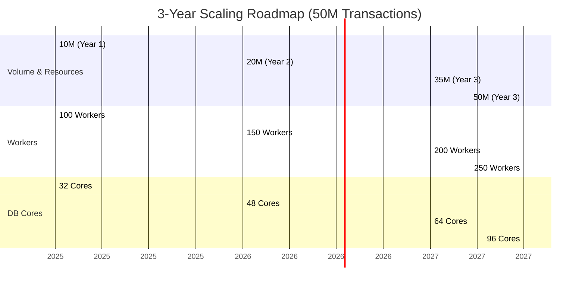

## 8. PERFORMANCE REQUIREMENTS

### 8.1 Performance Targets

#### 8.1.1 Primary Performance Metrics

| Metric                  | Current Target     | 3-Year Target      | Measurement                                      |
|-------------------------|--------------------|--------------------|--------------------------------------------------|
| **Throughput**          | 5,556 req/s aggregate | 27,778 req/s       | Total JE created / elapsed time                  |
| **Window Time**         | 20 minutes (buffer: 100 min) | 45 minutes (buffer: 75 min) | Start to commit complete                         |
| **Success Rate**        | 99.9%              | 99.9%              | Successful batches / total attempts              |
| **Worker Efficiency**   | 720 req/s per worker | 720 req/s per worker | Maintained across scale                          |
| **P95 Latency**         | <50ms per transaction | <50ms per transaction | Per-transaction processing time                  |

---

#### 8.1.2 Current Volume Breakdown (10M Transactions)

```mermaid
gantt
    title Phase Breakdown for 10M Transactions (Target: 20 min)
    dateFormat  X
    axisFormat %M:%S

    section Target
    Pre-Flight Validation   :done,    t1, 0, 2m
    Sequence Allocation     :active,  t2, after t1, 30s
    Worker Launch           :active,  t3, after t2, 30s
    Parallel Processing     :crit,    t4, after t3, 12m
    Per-Worker Validation   :         t5, after t4, 1m
    Pre-Commit Validation   :         t6, after t5, 2m
    Atomic Commit           :crit,    t7, after t6, 4m
    Post-Processing         :         t8, after t7, 2m

    section Buffer
    Available Buffer        :milestone, after t8, 96m
```

| Phase                     | Target Time | % of Window |
|---------------------------|-------------|-------------|
| Pre-Flight Validation     | 2 min       | 10%         |
| Sequence Allocation       | 30 sec      | 2.5%        |
| Worker Launch             | 30 sec      | 2.5%        |
| **Parallel Processing**   | **12 min**  | **60%**     |
| Per-Worker Validation     | 1 min       | 5%          |
| Pre-Commit Validation     | 2 min       | 10%         |
| Atomic Commit             | 4 min       | 20%         |
| Post-Processing           | 2 min       | 10%         |
| **TOTAL**                 | **24 min**  | **120% (buffer)** |
| **Target with Buffer**    | **20 min**  | **100%**    |

> **Remaining Buffer:** **96 minutes**

---

#### 8.1.3 Growth Projection (50M Transactions in 3 Years)

| Volume         | Workers | DB Cores | Time   | Throughput     |
|----------------|---------|----------|--------|----------------|
| 10M (Year 1)   | 100     | 32       | 20 min | 8,333/s        |
| 20M (Year 2)   | 150     | 48       | 25 min | 13,333/s       |
| 35M (Year 3)   | 200     | 64       | 35 min | 16,667/s       |
| **50M (Year 3)** | **250** | **96**   | **45 min** | **18,519/s** |

> **Key Insight:** **Linear scaling with worker count**  
> - Workers scale **horizontally** (add servers)  
> - Database scales **vertically** (add cores)  
> - Maintains **75+ minute buffer** at all scales
