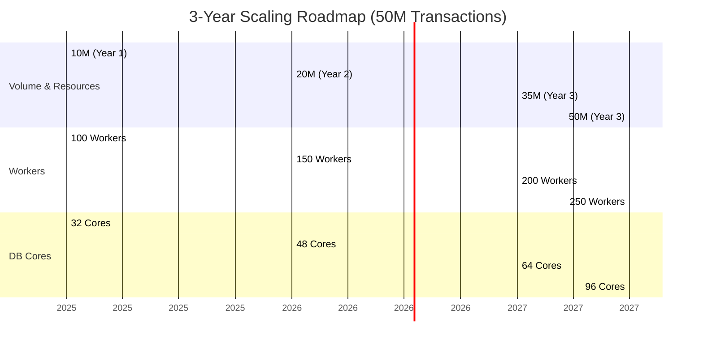
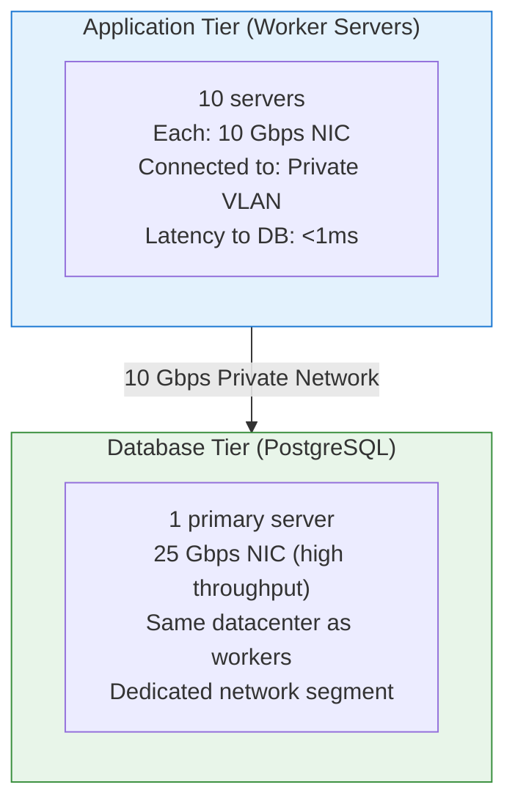
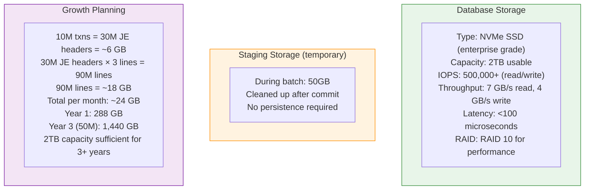

## 8. PERFORMANCE REQUIREMENTS

### 8.1 Performance Targets

#### 8.1.1 Primary Performance Metrics

| Metric                  | Current Target     | 3-Year Target      | Measurement                                      |
|-------------------------|--------------------|--------------------|--------------------------------------------------|
| **Throughput**          | 5,556 req/s aggregate | 27,778 req/s       | Total JE created / elapsed time                  |
| **Window Time**         | 20 minutes (buffer: 100 min) | 45 minutes (buffer: 75 min) | Start to commit complete                         |
| **Success Rate**        | 99.9%              | 99.9%              | Successful batches / total attempts              |
| **Worker Efficiency**   | 720 req/s per worker | 720 req/s per worker | Maintained across scale                          |
| **P95 Latency**         | <50ms per transaction | <50ms per transaction | Per-transaction processing time                  |

---

#### 8.1.2 Current Volume Breakdown (10M Transactions)

```mermaid
gantt
    title Phase Breakdown for 10M Transactions (Target: 20 min)
    dateFormat  X
    axisFormat %M:%S

    section Target
    Pre-Flight Validation   :done,    t1, 0, 2m
    Sequence Allocation     :active,  t2, after t1, 30s
    Worker Launch           :active,  t3, after t2, 30s
    Parallel Processing     :crit,    t4, after t3, 12m
    Per-Worker Validation   :         t5, after t4, 1m
    Pre-Commit Validation   :         t6, after t5, 2m
    Atomic Commit           :crit,    t7, after t6, 4m
    Post-Processing         :         t8, after t7, 2m

    section Buffer
    Available Buffer        :milestone, after t8, 96m
```



| Phase                     | Target Time | % of Window |
|---------------------------|-------------|-------------|
| Pre-Flight Validation     | 2 min       | 10%         |
| Sequence Allocation       | 30 sec      | 2.5%        |
| Worker Launch             | 30 sec      | 2.5%        |
| **Parallel Processing**   | **12 min**  | **60%**     |
| Per-Worker Validation     | 1 min       | 5%          |
| Pre-Commit Validation     | 2 min       | 10%         |
| Atomic Commit             | 4 min       | 20%         |
| Post-Processing           | 2 min       | 10%         |
| **TOTAL**                 | **24 min**  | **120% (buffer)** |
| **Target with Buffer**    | **20 min**  | **100%**    |

> **Remaining Buffer:** **96 minutes**

---

#### 8.1.3 Growth Projection (50M Transactions in 3 Years)



| Volume         | Workers | DB Cores | Time   | Throughput     |
|----------------|---------|----------|--------|----------------|
| 10M (Year 1)   | 100     | 32       | 20 min | 8,333/s        |
| 20M (Year 2)   | 150     | 48       | 25 min | 13,333/s       |
| 35M (Year 3)   | 200     | 64       | 35 min | 16,667/s       |
| **50M (Year 3)** | **250** | **96**   | **45 min** | **18,519/s** |

> **Key Insight:** **Linear scaling with worker count**  
> - Workers scale **horizontally** (add servers)  
> - Database scales **vertically** (add cores)  
> - Maintains **75+ minute buffer** at all scales

## 8.2 Database Performance Requirements

### 8.2.1 PostgreSQL Configuration

```ini
# postgresql.conf - Month-End Batch Optimized Configuration

# CONNECTION SETTINGS
max_connections = 250                    # 100 workers + 50 monitoring + 100 buffer
shared_buffers = 64GB                    # 25% of 256GB RAM during batch
effective_cache_size = 192GB             # 75% of 256GB RAM

# WRITE PERFORMANCE
wal_buffers = 16MB
checkpoint_completion_target = 0.9
max_wal_size = 10GB
min_wal_size = 2GB

# PARALLEL QUERY
max_worker_processes = 32
max_parallel_workers_per_gather = 8
max_parallel_workers = 24
parallel_setup_cost = 100
parallel_tuple_cost = 0.01

# MAINTENANCE
maintenance_work_mem = 2GB
autovacuum_max_workers = 4
autovacuum_naptime = 10s

# LOGGING (for batch monitoring)
log_min_duration_statement = 1000       # Log queries > 1 second
log_checkpoints = on
log_connections = on
log_disconnections = on
log_duration = off
log_line_prefix = '%t [%p]: [%l-1] user=%u,db=%d,app=%a,client=%h '

# BATCH-SPECIFIC SETTINGS (applied during window)
work_mem = 256MB                         # Per-worker operation memory
temp_buffers = 128MB
effective_io_concurrency = 200           # For NVMe SSD

# COST-BASED VACUUM (disabled during batch)
autovacuum = off                         # Re-enable after batch
```

### 8.2.2 Index Strategy
```sql
-- Optimized indexes for batch processing

-- Source Tables (Read Performance)
CREATE INDEX CONCURRENTLY idx_premium_batch_ready 
    ON premium_transaction(payment_date, txn_id) 
    WHERE batch_processed = FALSE;

CREATE INDEX CONCURRENTLY idx_claims_batch_ready 
    ON claims_transaction(claim_date, claim_id) 
    WHERE batch_processed = FALSE;

-- Staging Tables (Write Performance)
-- No indexes during insert! Add after data load
-- Indexes built in Phase 4 (Post-Processing)

-- Production Tables (Write Performance)
-- Existing indexes are sufficient
-- Consider DROP INDEX during batch, REBUILD after (for very large scale)

-- For 50M transaction scale (Year 3):
-- Option: Drop indexes before batch, rebuild after
DROP INDEX IF EXISTS idx_je_date;
DROP INDEX IF EXISTS idx_je_reference;

-- After batch commit:
CREATE INDEX CONCURRENTLY idx_je_date ON journal_entry_header(je_date);
CREATE INDEX CONCURRENTLY idx_je_reference 
    ON journal_entry_header(reference_type, reference_id);

-- This approach:
-- - Speeds up bulk insert by 40-60%
-- - Rebuilds indexes in 10-15 minutes (parallel)
-- - Total time still < 2 hour window
```

### 8.2.3 Database Partitioning Strategy (Year 3)
```sql
-- For 50M+ transactions, partition production tables by month

-- Step 1: Convert to partitioned table
ALTER TABLE journal_entry_header 
    RENAME TO journal_entry_header_old;

CREATE TABLE journal_entry_header (
    je_id BIGINT NOT NULL,
    je_number VARCHAR(50) NOT NULL,
    je_date DATE NOT NULL,
    -- ... all other columns
    batch_id VARCHAR(50),
    PRIMARY KEY (je_id, je_date)  -- Include partition key
) PARTITION BY RANGE (je_date);

-- Step 2: Create monthly partitions
CREATE TABLE journal_entry_header_2025_01 
    PARTITION OF journal_entry_header
    FOR VALUES FROM ('2025-01-01') TO ('2025-02-01');

CREATE TABLE journal_entry_header_2025_02 
    PARTITION OF journal_entry_header
    FOR VALUES FROM ('2025-02-01') TO ('2025-03-01');

-- Repeat for all months...

-- Step 3: Migrate historical data
INSERT INTO journal_entry_header 
SELECT * FROM journal_entry_header_old;

-- Benefits:
-- 1. Batch writes to single partition (faster)
-- 2. Historical data doesn't slow current batch
-- 3. Easy archival (detach old partitions)
-- 4. Parallel index builds per partition
```
## 8.3 Network & Infrastructure Requirements
### 8.3.1 Network Specifications

Requirement,Specification
Bandwidth,10 Gbps minimum
Latency,<1ms between tiers
Packet Loss,<0.001%
NAT,No NAT between workers and DB
Firewall,No inspection on internal traffic

### 8.3.2 Storage Requirements

## 8.4 Performance Monitoring
### 8.4.1 Key Performance Indicators (KPIs)

```python
# KPI Tracking System
class BatchPerformanceKPI:
    """Track and report batch performance KPIs"""
    
    def __init__(self, batch_id: str):
        self.batch_id = batch_id
        self.metrics = {}
    
    def calculate_kpis(self) -> Dict:
        """Calculate all KPIs for batch"""
        
        master = StagingMonthEndMaster.objects.get(batch_id=self.batch_id)
        
        # Timing KPIs
        total_time = (
            master.committed_at - master.processing_started_at
        ).total_seconds()
        
        # Throughput KPIs
        total_transactions = (
            master.source_premium_count + master.source_claims_count
        )
        throughput_rps = total_transactions / total_time
        
        # Efficiency KPIs
        worker_efficiency = throughput_rps / master.worker_count
        
        # Quality KPIs
        validation_failures = BatchValidationResults.objects.filter(
            batch_id=self.batch_id,
            status='FAIL'
        ).count()
        
        worker_failures = BatchWorkerControl.objects.filter(
            batch_id=self.batch_id,
            status='FAILED'
        ).count()
        
        return {
            'batch_id': self.batch_id,
            'timing': {
                'total_time_seconds': total_time,
                'total_time_minutes': total_time / 60,
                'target_time_minutes': 20,
                'buffer_remaining_minutes': 120 - (total_time / 60),
                'on_time': total_time / 60 <= 20
            },
            'throughput': {
                'transactions_per_second': throughput_rps,
                'target_transactions_per_second': 5556,
                'performance_ratio': throughput_rps / 5556,
                'journal_entries_per_second': (throughput_rps * 3)
            },
            'efficiency': {
                'worker_efficiency_rps': worker_efficiency,
                'target_worker_efficiency': 720,
                'worker_utilization': worker_efficiency / 720
            },
            'quality': {
                'validation_failures': validation_failures,
                'worker_failures': worker_failures,
                'success_rate': 1.0 if validation_failures == 0 else 0.0
            },
            'scale': {
                'transactions_processed': total_transactions,
                'journal_entries_created': master.actual_je_count,
                'workers_used': master.worker_count
            }
        }
```
### 8.4.2 Performance Alerts
```python
# Alert Thresholds
PERFORMANCE_THRESHOLDS = {
    'throughput_warning': 4000,      # Alert if < 4000 req/s
    'throughput_critical': 2000,     # Critical if < 2000 req/s
    'worker_efficiency_warning': 500, # Alert if < 500 req/s per worker
    'eta_warning_minutes': 25,       # Alert if ETA > 25 minutes
    'eta_critical_minutes': 90,      # Critical if ETA > 90 minutes
    'worker_failure_warning': 5,     # Alert if > 5 workers fail
    'worker_failure_critical': 20,   # Critical if > 20 workers fail
}

def check_performance_thresholds(batch_id: str) -> List[Alert]:
    """Monitor batch and generate alerts"""
    
    kpis = BatchPerformanceKPI(batch_id).calculate_kpis()
    alerts = []
    
    # Throughput check
    throughput = kpis['throughput']['transactions_per_second']
    if throughput < PERFORMANCE_THRESHOLDS['throughput_critical']:
        alerts.append(Alert(
            level='CRITICAL',
            message=f'Throughput critically low: {throughput} req/s',
            action='Add more workers immediately'
        ))
    elif throughput < PERFORMANCE_THRESHOLDS['throughput_warning']:
        alerts.append(Alert(
            level='WARNING',
            message=f'Throughput below target: {throughput} req/s',
            action='Monitor closely, consider adding workers'
        ))
    
    # ETA check
    monitor = ProgressMonitor(batch_id)
    status = monitor.get_current_status()
    
    if status.eta_minutes > PERFORMANCE_THRESHOLDS['eta_critical_minutes']:
        alerts.append(Alert(
            level='CRITICAL',
            message=f'ETA exceeds window: {status.eta_minutes} minutes',
            action='URGENT: Scale up workers or abort and reschedule'
        ))
    
    return alerts
```
## 9. MONITORING & OBSERVABILITY
### 9.1 Real-Time Dashboard
#### 9.1.1 Dashboard Layout

# Month-End Batch Monitoring Dashboard

```text
┌────────────────────────────────────────────────────────────┐
│         MONTH-END BATCH MONITORING DASHBOARD               │
│                  Batch: 2025-01-MONTHEND                   │
├────────────────────────────────────────────────────────────┤
│                                                            │
│  STATUS: PROCESSING                    elapsed: 00:14:23 │
│  ████████████████████░░ 82.3%          remaining: 00:03:45 │
│                                                            │
├─────────────────────────┬──────────────────────────────────┤
│  THROUGHPUT             │  WORKERS                         │
│  ┌──────────────────┐   │  ┌────────────────────────────┐ │
│  │ Current: 9,723   │   │  │  Running:    98          │ │
│  │ Average: 9,728   │   │  │  Complete:    0          │ │
│  │ Peak:   11,247   │   │  │  Slow:       2          │ │
│  │ Target:  5,556   │   │  │  Failed:      0          │ │
│  │                  │   │  │                            │ │
│  │ 175% of target   │   │  │ Workers 15, 47 running slow│ │
│  └──────────────────┘   │  └────────────────────────────┘ │
│                         │                                  │
├─────────────────────────┼──────────────────────────────────┤
│  PERFORMANCE            │  DATABASE                        │
│  ┌──────────────────┐   │  ┌────────────────────────────┐ │
│  │ P50:   8.2ms     │   │  │ Connections: 112/250       │ │
│  │ P95:  34.7ms     │   │  │ Utilization: 44.8%         │ │
│  │ P99:  67.3ms     │   │  │ Query Time:  2.3ms         │ │
│  │ Max: 128.5ms     │   │  │ Cache Hit:  99.2%          │ │
│  └──────────────────┘   │  └────────────────────────────┘ │
│                         │                                  │
├─────────────────────────┼──────────────────────────────────┤
│  VALIDATION             │  RESOURCES                       │
│  ┌──────────────────┐   │  ┌────────────────────────────┐ │
│  │ Pre-Flight:      │   │  │ CPU:     68.4%             │ │
│  │ Per-Worker:      │   │  │ Memory:  71.2%             │ │
│  │ Pre-Commit:      │   │  │ Disk:    43.8%             │ │
│  └──────────────────┘   │  │ Network: 3.2 Gbps          │ │
│                         │  └────────────────────────────┘ │
│                         │                                  │
├─────────────────────────┴──────────────────────────────────┤
│  RECENT EVENTS                                             │
│  23:14:23 - Worker 47 checkpoint: 87k/100k (87%)          │
│  23:14:18 - Worker 15 checkpoint: 89k/100k (89%)          │
│  23:14:12 - Global throughput: 9,723 req/s               │
│  23:14:06 - Worker 23 completed successfully              │
│  23:14:01 - Worker 8 completed successfully               │
│                                                            │
├────────────────────────────────────────────────────────────┤
│  ALERTS: None                                              │
└────────────────────────────────────────────────────────────┘
```
> Last Updated: 2025-01-31 23:14:28 | Auto-refresh: 5s
