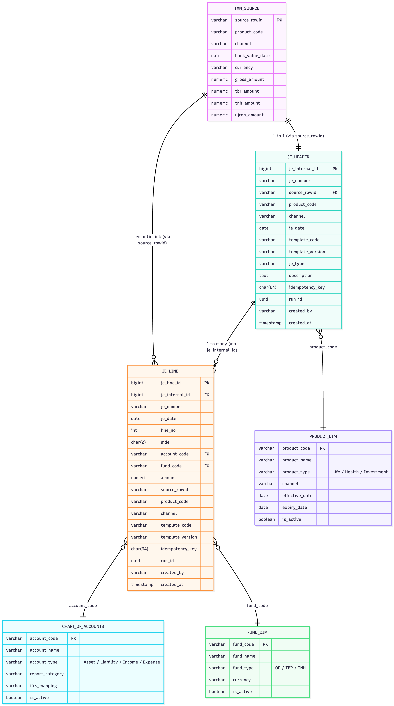

## 🧭 Structure Overview

| Layer                    | Tables                                         | Function                                                                                  |
| ------------------------ | ---------------------------------------------- | ----------------------------------------------------------------------------------------- |
| **Source (Business)**    | `txn_source`                                   | Raw operational transactions from upstream (policy admin, claims, billing)                |
| **Accounting (Staging)** | `je_header`, `je_line`                         | Generated journals — each header summarizing one business event, each line a debit/credit |
| **Dimensions**           | `chart_of_accounts`, `fund_dim`, `product_dim` | Reference structures for reporting, validation, and financial statement mapping           |

## 🧮 Data Lineage Summary
| Trace Path                                              | Description                | Typical Use                     |
| ------------------------------------------------------- | -------------------------- | ------------------------------- |
| `txn_source.source_rowid → je_header.source_rowid`      | Business → Journal trace   | Transaction-to-accounting audit |
| `je_header.je_internal_id → je_line.je_internal_id`     | Header → Lines             | Ledger reconstruction           |
| `je_line.account_code → chart_of_accounts.account_code` | Line → Chart of Accounts   | Financial statement rollup      |
| `je_line.fund_code → fund_dim.fund_code`                | Line → Fund                | Takaful fund segregation        |
| `je_header.product_code → product_dim.product_code`     | Header → Product dimension | Product-level profitability     |

## 🧾 Reporting Hierarchy (simplified)
### Trial Balance
```text
CHART_OF_ACCOUNTS
    ↑
JE_LINE  ←  JE_HEADER  ←  TXN_SOURCE
```

### Fund Statement (Takaful)
```text
FUND_DIM
    ↑
JE_LINE (fund movements)
```
### Product P&L
```text
PRODUCT_DIM
    ↑
JE_HEADER + JE_LINE (aggregated by product_code)

```

### 🧠 Audit Flow Example
#### Operational control
1. Trace a specific premium receipt:
  ```sql
  SELECT * FROM txn_source WHERE source_rowid='TXN-0001234';
SELECT * FROM je_header WHERE source_rowid='TXN-0001234';
SELECT * FROM je_line WHERE source_rowid='TXN-0001234';
```
#### Accounting reconstruction
   To rebuild the ledger for October 2025:
   ```sql
   SELECT account_code, SUM(CASE WHEN side='DR' THEN amount ELSE -amount END)
   FROM je_line
   WHERE je_date BETWEEN '2025-10-01' AND '2025-10-31'GROUP BY account_code;
   ```
#### Fund segregation
Verify Tabarru / Tanahud / Operator movements:
```sql
SELECT fund_code, SUM(amount) FROM je_line GROUP BY fund_code;

```


### Complete logical structure and audit trail relationships between txn_source, je_header, and je_line


