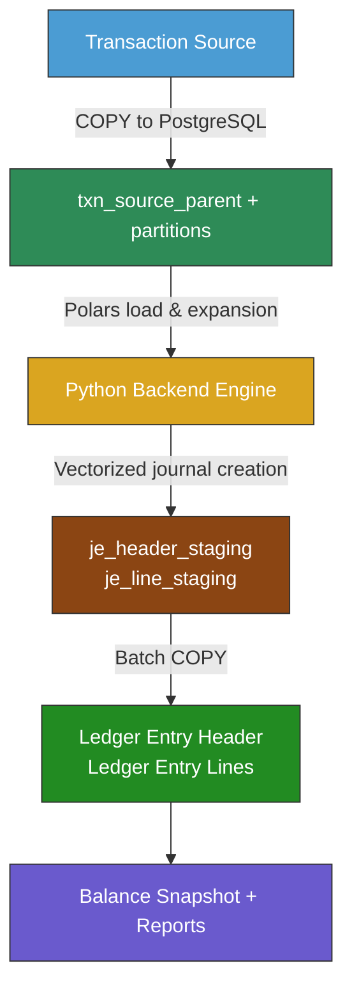
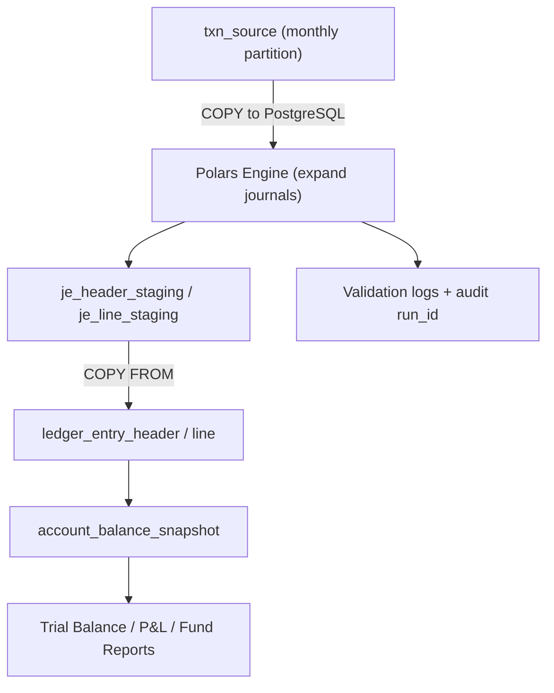

# Financial Ledger System – High-Throughput Journal Engine  
*Scalable, auditable, and IFRS-17 ready accounting pipeline for 1M–10M transactions per batch*

---

# 🧭 1. System Overview
A **hybrid architecture**:
* **PostgreSQL** is the system of record — it holds truth: source transactions, journal templates, ledger, balances, and constraints.
* **Python (Polars + Psycopg + FastAPI)** is the compute and orchestration engine — it handles large-scale journal expansion, vectorized fund allocation, and posting.
* The design combines **ACID compliance + analytical performance**, suitable for 1M–10M transactions per batch.

---

# 🧩 2. Core Database Layers

[*Click for detail DDL*](./tables.md)

## 2.1. Source Data Layer
* Table: ```txn_source_parent``` (partitioned by txn_month)
* Purpose: store pre-allocated transactions (premium/claim inflow/outflow).
* Loaded via: ```COPY``` (1–2 seconds per 1M rows).
* Design: ```no triggers, txn_month precomputed``` in Polars, partitioned monthly.
* Indexes:
  * BRIN on ```bank_value_date```
  * B-tree on ```product_code, channel```
* Lifecycle:
  * 3 months active, older → archive → drop.
    
## 2.2. Template Layer
**Tables** in schema ```acct.```:
| Table                    | Purpose                                                        |
| ------------------------ | -------------------------------------------------------------- |
| `journal_template`       | header: code, version, type, effective date, control flags     |
| `journal_template_match` | routing rules: product_code, channel, condition_expr, priority |
| `journal_template_line`  | line definitions: DR/CR, account_code, fund, amount_expr       |
| `chart_of_accounts`      | master chart (account_code, description, type, fund)           |
| `product_account_map`    | optional overrides for account/fund mapping                    |

**Design Principle**: fully **data-driven accounting policy**, editable by finance users, version-controlled.

## 2.3. Staging Layer
| Table               | Role                                         | Notes                                    |
| ------------------- | -------------------------------------------- | ---------------------------------------- |
| `je_header_staging` | journal headers before posting               | includes `run_id`, `template_code`, etc. |
| `je_line_staging`   | journal lines expanded in Polars             | up to 8–10× `txn_source` volume          |
| Both                | UNLOGGED tables                              | improve speed; safe since re-creatable   |
| Purpose             | Audit, reconciliation, pre-ledger validation | holds full DR/CR, before commit          |

✅ Posted flag + timestamps enable rollback/reposting tracking.
✅ Idempotency via ```run_id```.

## 2.4. Ledger Layer
| Table                      | Role                                                   |
| -------------------------- | ------------------------------------------------------ |
| `ledger_entry_header`      | immutable accounting header (partitioned monthly)      |
| `ledger_entry_line`        | detailed lines; 1–N relationship with header           |
| `account_balance_snapshot` | monthly fund/account aggregates for fast trial balance |
### Indexes:
* PK (je_id, je_number)
* B-tree on account_code, fund
* BRIN on je_date
### Characteristics:
* Append-only
* Partitioned monthly
* Posting done via COPY FROM for both header & lines
* Posting duration: ~60s for 8M lines

---
  
# 🧮 3. Python (Polars) Backend Layer

## Key components:
| Module               | Function                                               |
| -------------------- | ------------------------------------------------------ |
| `data_loader.py`     | loads CSV or DB data into Polars                       |
| `template_loader.py` | loads journal templates from PostgreSQL                |
| `engine.py`          | expands transactions → JE headers + lines (vectorized) |
| `staging_writer.py`  | writes results back via `COPY FROM`                    |
| `ledger_poster.py`   | posts from staging → ledger (optimized path)           |
| `balancer.py`        | recalculates account balances                          |

# 🧠 4. Governance, Validation, and Audit 
| Mechanism                              | Location    | Purpose                         |
| -------------------------------------- | ----------- | ------------------------------- |
| Check constraint `chk_takaful_balance` | DB          | ensures gross = sum(components) |
| Template-level balance check           | Polars      | ensures DR=CR                   |
| `run_id` + staging tables              | DB          | trace batch lineage             |
| Template versioning                    | DB          | audit rule evolution            |
| Account balance snapshots              | DB          | monthly reconciliation          |
| Logs & metrics                         | Python + DB | performance & audit trail       |

## Core computation (vectorized)
* Fund decomposition pre-done at source → no runtime allocation loops.
* Amounts derived from template expressions like ```:tabarru_amount, :ujroh_amount```.
* Polars evaluates all lines in parallel (Rust backend).
* Validates DR=CR per ```template_control```.
  
## Performance targets:
| Step                   | Rows                 | Time |
| ---------------------- | -------------------- | ---- |
| Load transactions      | 1M                   | < 1s |
| Journal expansion      | 1M                   | ~4s  |
| COPY to staging        | 1M header + 8M lines | 25s  |
| Post to ledger         | 8M lines             | 60s  |
| Trial balance snapshot | aggregate            | <5s  |

---

# 🧰 5. Operational Utilities

## Partition rotation
* Auto-create next month’s partitions (rotate_txn_source_partitions())
* Add BRIN/B-tree indexes + ANALYZE
## Retention management
* Keep 12 months active → drop or archive older partitions.
## Job orchestration
* Cron / Airflow DAG:
  1. rotate_txn_source_partitions
  1. COPY new txn_source
  1. expand_journals()
  1. stage → ledger 
  1.update_balance_snapshot 
  1. archive old data
## Versioning
* All Python engines and SQL schemas versioned under Git
* Template updates through controlled release (finance approval + audit log)

---

# 🔒 6. Compliance and Safety

PostgreSQL ACID + WAL for ledger data
* UNLOGGED staging to isolate transient load
* Full reconciliation possible from:
  * ```txn_source → je_line_staging → ledger_entry_line```
* Checksums and hash-based reconciliation (optional enhancement)
* IFRS-17 ready (each fund’s journal separately posted)

---

# ⚙️ 7. Stack Summary

| Layer               | Technology                      | Reason                                        |
| ------------------- | ------------------------------- | --------------------------------------------- |
| **Database**        | PostgreSQL 15+                  | ACID ledger, partitioning, PL/pgSQL utilities |
| **Compute Engine**  | Python + Polars                 | vectorized parallel processing                |
| **Ingestion**       | COPY / Psycopg binary           | max throughput                                |
| **Orchestration**   | Airflow or cron                 | repeatable scheduling                         |
| **Visualization**   | Metabase / ClickHouse / Grafana | reports & dashboards                          |
| **Version Control** | Git + migration scripts         | governance & reproducibility                  |

---

# 🧩 8. Conceptual Flow Summary



---

# ✅ 9. Core philosophy summary

| Principle                        | Implementation                               |
| -------------------------------- | -------------------------------------------- |
| **Database is truth**            | PostgreSQL holds validated data & rules      |
| **Backend does heavy math**      | Polars for parallel fund & journal expansion |
| **Data-driven templates**        | Editable via SQL, version-controlled         |
| **High throughput, low latency** | COPY + vectorized compute                    |
| **Strong auditability**          | Staging + run_id + reconciled snapshots      |
| **Maintainability**              | Modular Python + clear DB schema boundaries  |
