## 🧭 1️⃣ Pipeline Overview
| Layer                    | Tables                                     | Purpose                                      | Data Origin                     |
| ------------------------ | ------------------------------------------ | -------------------------------------------- | ------------------------------- |
| **Transactional Source** | `txn_source`                               | Raw business events (premium, claim, refund) | Operational system              |
| **Journal Staging**      | `je_header_staging`, `je_line_staging`     | Pre-posted journals (generated by Polars)    | Accounting engine               |
| **Journal Control**      | `je_batch_control`                         | Metadata for each posting batch              | Created when staging finishes   |
| **Ledger Core**          | `ledger_entry_header`, `ledger_entry_line` | Posted journals (immutable)                  | From staging after verification |
| **Ledger Balances**      | `account_balance_snapshot`                 | Aggregated balances per account/fund/period  | Derived from posted lines       |

---
### Data Flow (General)

```mermaid
flowchart LR
    A["1️⃣ txn_source<br/>(gross_amount and components)"] --> B["2️⃣ Template Routing<br/>(match product/channel/txn_type)"]
    B --> C["3️⃣ Expand Journal Lines<br/>evaluate amount_expr"]
    C --> D["4️⃣ Validate DR=CR (template_control)"]
    D --> E["5️⃣ Stage JE Header & Line<br/>(UNLOGGED staging tables)"]
    E --> F["6️⃣ Post to Ledger<br/>partitioned by month"]
    F --> G["7️⃣ Update Balances & MVs<br/>Trial Balance, Fund Statement"]

```

---
### Sequence Diagram

```mermaid
sequenceDiagram
    autonumber
    participant TXN as txn_source
    participant TMP as journal_template*
    participant APP as Backend Engine (Python + Polars)
    participant STG as je_*_staging
    participant LED as ledger_entry_*
    participant REP as Reporting Views

    TXN->>APP: ① Load new txn_source (premium/claim)
    APP->>TMP: ② Lookup template + match by product/channel/date
    TMP-->>APP: ③ Return active lines and conditions
    APP->>APP: ④ Compute amount_expr (Polars)
    APP->>APP: ⑤ Validate DR=CR within tolerance
    APP->>STG: ⑥ COPY headers + lines
    STG->>LED: ⑦ Post to ledger partitions
    LED->>REP: ⑧ Update balances and materialized views

```

---
### Operational Lifecyce

```mermaid
flowchart TD
    LOAD["① Load txn_source"]
    MATCH["② Match template + expand journals"]
    VALID["③ Validate integrity (DR=CR)"]
    STAGE["④ Stage to je_header_staging / je_line_staging"]
    POST["⑤ Post to ledger partitions"]
    SNAP["⑥ Update account_balance_snapshot"]
    ARCH["⑦ Archive failed/QA runs"]
    PURGE["⑧ Purge old partitions"]
    LOAD --> MATCH --> VALID --> STAGE --> POST --> SNAP --> ARCH --> PURGE

```

---
### ER Model

---


## 🧱 2️⃣ Posting Process: Staging → Ledger
### Step 1: Validation
* Ensure double-entry rule: total DR = total CR per je_internal_id.
* Ensure all accounts and funds exist in dimension tables.
* Lock posting batch via je_batch_control:
* run_id
* total_headers
* total_lines
* hash_checksum
* created_at, created_by
* Step 2: Posting
* Copy staged journals to permanent ledger tables:
* ledger_entry_header (PK = je_id, unique je_number)
* ledger_entry_line (FK = je_id)
* Append-only (no updates).
### Step 3: Balances Update
* Aggregate to account_balance_snapshot:
* Group by (account_code, fund_code, period)
* Compute opening_balance, debit, credit, closing_balance
### Step 4: Audit Trail Completion
* Mark je_header_staging and je_line_staging as posted = TRUE and store posted_at.
* Retain run_id linkage across all layers.

## 🧭 Structure Overview

| Layer                    | Tables                                         | Function                                                                                  |
| ------------------------ | ---------------------------------------------- | ----------------------------------------------------------------------------------------- |
| **Source (Business)**    | `txn_source`                                   | Raw operational transactions from upstream (policy admin, claims, billing)                |
| **Accounting (Staging)** | `je_header`, `je_line`                         | Generated journals — each header summarizing one business event, each line a debit/credit |
| **Dimensions**           | `chart_of_accounts`, `fund_dim`, `product_dim` | Reference structures for reporting, validation, and financial statement mapping           |

## 🧠 4️⃣ Data Lineage
| From                                             | To                                    | Key                               | Purpose |
| ------------------------------------------------ | ------------------------------------- | --------------------------------- | ------- |
| `txn_source` → `je_header_staging`               | `source_rowid`                        | Trace transaction origin          |         |
| `je_header_staging` → `ledger_entry_header`      | `je_number`, `run_id`                 | Transition from staging to posted |         |
| `je_line_staging` → `ledger_entry_line`          | `je_internal_id` → `je_id`            | Maintain line-level trace         |         |
| `ledger_entry_line` → `account_balance_snapshot` | `account_code`, `fund_code`, `period` | Summarize financial position      |         |

## 🧩 5️⃣ Posting Control Logic (conceptual)
| Phase                   | Action                              | Validation                  |
| ----------------------- | ----------------------------------- | --------------------------- |
| **Pre-check**           | Verify DR = CR                      | Reject if imbalance         |
| **Batch registration**  | Create entry in `je_batch_control`  | Store checksum              |
| **Posting**             | Insert into `ledger_entry_*` tables | Ensure unique `je_number`   |
| **Balance aggregation** | Update/insert snapshots             | Consistency by fund/account |
| **Finalize**            | Mark batch as POSTED                | Write `posted_at` timestamp |


## 🧮 Data Lineage Summary
| Trace Path                                              | Description                | Typical Use                     |
| ------------------------------------------------------- | -------------------------- | ------------------------------- |
| `txn_source.source_rowid → je_header.source_rowid`      | Business → Journal trace   | Transaction-to-accounting audit |
| `je_header.je_internal_id → je_line.je_internal_id`     | Header → Lines             | Ledger reconstruction           |
| `je_line.account_code → chart_of_accounts.account_code` | Line → Chart of Accounts   | Financial statement rollup      |
| `je_line.fund_code → fund_dim.fund_code`                | Line → Fund                | Takaful fund segregation        |
| `je_header.product_code → product_dim.product_code`     | Header → Product dimension | Product-level profitability     |

## 🧾 Reporting Hierarchy (simplified)
### Trial Balance
```text
CHART_OF_ACCOUNTS
    ↑
JE_LINE  ←  JE_HEADER  ←  TXN_SOURCE
```

### Fund Statement (Takaful)
```text
FUND_DIM
    ↑
JE_LINE (fund movements)
```
### Product P&L
```text
PRODUCT_DIM
    ↑
JE_HEADER + JE_LINE (aggregated by product_code)

```



```mermaid
flowchart LR
    %% SOURCE
    subgraph SOURCE["Source Transactions"]
        A["txn_source<br/>gross_amount = tabarru + tanahud + invest + ujroh + admin"]
    end

    %% BACKEND
    subgraph BACKEND["Backend Engine (Python + Polars)"]
        B1["1️⃣ Load txn_source from PostgreSQL"]
        B2["2️⃣ Match Journal Template<br/>(txn_type, product, channel, date, priority)"]
        B3["3️⃣ Expand Journal Lines<br/>Evaluate amount_expr using Polars"]
        B4["4️⃣ Validate Balance<br/>(require_balanced, tolerance)"]
    end

    %% STAGING
    subgraph STAGING["Database Staging (UNLOGGED)"]
        S1["je_header_staging"]
        S2["je_line_staging"]
    end

    %% LEDGER
    subgraph LEDGER["Official Ledger (Partitioned by Month)"]
        L1["ledger_entry_header"]
        L2["ledger_entry_line"]
        L3["account_balance_snapshot"]
    end

    %% REPORTING
    subgraph REPORT["Reporting & Analytics"]
        R1["Materialized Views<br/>Trial Balance / Fund / IFRS-17"]
    end

    %% FLOW
    A --> B1 --> B2 --> B3 --> B4 --> S1 & S2
    S1 & S2 --> LEDGER
    LEDGER --> R1

```

### 🧠 Audit Flow Example
#### Operational control
1. Trace a specific premium receipt:
  ```sql
  SELECT * FROM txn_source WHERE source_rowid='TXN-0001234';
SELECT * FROM je_header WHERE source_rowid='TXN-0001234';
SELECT * FROM je_line WHERE source_rowid='TXN-0001234';
```
#### Accounting reconstruction
   To rebuild the ledger for October 2025:
   ```sql
   SELECT account_code, SUM(CASE WHEN side='DR' THEN amount ELSE -amount END)
   FROM je_line
   WHERE je_date BETWEEN '2025-10-01' AND '2025-10-31'GROUP BY account_code;
   ```
#### Fund segregation
Verify Tabarru / Tanahud / Operator movements:
```sql
SELECT fund_code, SUM(amount) FROM je_line GROUP BY fund_code;

```

🧾 6️⃣ Example Audit Queries

Find all JEs from one batch:
```sql
SELECT je_number, je_date FROM ledger_entry_header WHERE run_id = '...';
```

Trace back to transaction source:
```
SELECT t.*, h.je_number, h.run_id
FROM txn_source t
JOIN ledger_entry_header h ON t.source_rowid = h.source_rowid
WHERE h.je_number = '20251003-JEA-000000123';
```

Reconcile fund balances (Takaful view):
```sql
SELECT fund_code, SUM(CASE WHEN side='DR' THEN amount ELSE -amount END) AS net_movement
FROM ledger_entry_line
WHERE je_date BETWEEN '2025-10-01' AND '2025-10-31'
GROUP BY fund_code;
```

### Complete logical structure and audit trail relationships between txn_source, je_header, and je_line

### Operational Flow

```mermaid
sequenceDiagram
    autonumber
    participant TXN as Source<br/>(txn_source)
    participant APP as Backend Engine<br/>(Python + Polars)
    participant TMP as Template Catalog<br/>(journal_template*)
    participant STG as Staging Tables
    participant LED as Ledger Tables
    participant REP as Reporting Views

    TXN->>APP: ① Load new transactions<br/>(txn_type, gross_amount, components)
    APP->>TMP: ② Query journal_template + match<br/>by txn_type, product, channel
    TMP-->>APP: ③ Return applicable template lines + conditions
    APP->>APP: ④ Evaluate amount_expr<br/>(Polars vectorized)
    APP->>APP: ⑤ Validate DR=CR within tolerance
    APP->>STG: ⑥ COPY je_header_staging + je_line_staging
    STG->>LED: ⑦ Post to ledger_entry_header / line<br/>(partition by month)
    LED->>REP: ⑧ Update materialized views (trial balance, fund)

```


### Data flow diagram

### Template routing 

### End-to-end operation lifecycle

```mermaid
flowchart TD
    LOAD["① Load txn_source via COPY"]
    VALIDATE["② Validate fund decomposition<br/>(gross = sum of components)"]
    EXPAND["③ Expand to journals<br/>(via Polars templates)"]
    STAGE["④ Stage JE header & line"]
    POST["⑤ Post to ledger partitions"]
    BAL["⑥ Update account_balance_snapshot"]
    ARCHIVE["⑦ Archive failed/QA runs"]
    PURGE["⑧ Purge old staging partitions"]
    LOAD --> VALIDATE --> EXPAND --> STAGE --> POST --> BAL --> ARCHIVE --> PURGE

```

### Staging live cycle 


## SQL-based automatic partition rotation
```sql
-- parent
CREATE TABLE IF NOT EXISTS public.je_line_staging_parent
    (LIKE public.je_line_staging INCLUDING ALL)
    PARTITION BY RANGE (created_at);

-- procedure to rotate partitions
CREATE OR REPLACE PROCEDURE public.rotate_staging_partitions()
LANGUAGE plpgsql AS $$
DECLARE
    start_date DATE := date_trunc('month', current_date);
    next_date  DATE := start_date + interval '1 month';
    tbl_name   TEXT;
BEGIN
    tbl_name := format('je_line_staging_%s', to_char(start_date,'YYYYMM'));
    IF NOT EXISTS (
        SELECT 1 FROM pg_class WHERE relname = tbl_name
    ) THEN
        EXECUTE format(
          'CREATE UNLOGGED TABLE public.%I PARTITION OF public.je_line_staging_parent
           FOR VALUES FROM (%L) TO (%L)',
           tbl_name, start_date, next_date);
        RAISE NOTICE 'Created new staging partition: %', tbl_name;
    END IF;
END;
$$;

-- schedule monthly
CALL public.rotate_staging_partitions();

-- parent
CREATE TABLE IF NOT EXISTS public.je_line_staging_parent
    (LIKE public.je_line_staging INCLUDING ALL)
    PARTITION BY RANGE (created_at);

-- procedure to rotate partitions
CREATE OR REPLACE PROCEDURE public.rotate_staging_partitions()
LANGUAGE plpgsql AS $$
DECLARE
    start_date DATE := date_trunc('month', current_date);
    next_date  DATE := start_date + interval '1 month';
    tbl_name   TEXT;
BEGIN
    tbl_name := format('je_line_staging_%s', to_char(start_date,'YYYYMM'));
    IF NOT EXISTS (
        SELECT 1 FROM pg_class WHERE relname = tbl_name
    ) THEN
        EXECUTE format(
          'CREATE UNLOGGED TABLE public.%I PARTITION OF public.je_line_staging_parent
           FOR VALUES FROM (%L) TO (%L)',
           tbl_name, start_date, next_date);
        RAISE NOTICE 'Created new staging partition: %', tbl_name;
    END IF;
END;
$$;

-- schedule monthly
CALL public.rotate_staging_partitions();

CREATE OR REPLACE PROCEDURE public.purge_old_staging_partitions(retention_days INT DEFAULT 30)
LANGUAGE plpgsql AS $$
DECLARE
    cutoff DATE := current_date - retention_days;
    r RECORD;
BEGIN
    FOR r IN
        SELECT inhrelid::regclass AS part_table
        FROM pg_inherits
        WHERE inhparent = 'public.je_line_staging_parent'::regclass
    LOOP
        IF (r.part_table::text ~ 'je_line_staging_[0-9]{6}') THEN
            IF to_date(substring(r.part_table::text, '([0-9]{6})$'), 'YYYYMM') < date_trunc('month', cutoff)
            THEN
                EXECUTE format('DROP TABLE IF EXISTS %I CASCADE;', r.part_table);
                RAISE NOTICE 'Dropped old staging partition: %', r.part_table;
            END IF;
        END IF;
    END LOOP;
END;
$$;

-- run weekly
CALL public.purge_old_staging_partitions(30);

CREATE TABLE IF NOT EXISTS public.je_line_staging_archive
(LIKE public.je_line_staging INCLUDING ALL);

CREATE OR REPLACE PROCEDURE public.archive_failed_runs()
LANGUAGE plpgsql AS $$
BEGIN
    INSERT INTO public.je_line_staging_archive
    SELECT * FROM public.je_line_staging_parent s
     WHERE s.run_id IN (
        SELECT run_id FROM batch_control WHERE status IN ('FAILED','REVIEW')
     );
    RAISE NOTICE 'Archived failed runs to je_line_staging_archive';
END;
$$;

-- execute daily after validation
CALL public.archive_failed_runs();


```
```bash
0 0 * * * psql -d salam_accounting -c "CALL rotate_staging_partitions();"
30 0 * * 0 psql -d salam_accounting -c "CALL purge_old_staging_partitions(30);"
0 1 * * * psql -d salam_accounting -c "CALL post_batch(current_run_id());"

```
