## 🧭 1️⃣ Pipeline Overview
| Layer                    | Tables                                     | Purpose                                      | Data Origin                     |
| ------------------------ | ------------------------------------------ | -------------------------------------------- | ------------------------------- |
| **Transactional Source** | `txn_source`                               | Raw business events (premium, claim, refund) | Operational system              |
| **Journal Staging**      | `je_header_staging`, `je_line_staging`     | Pre-posted journals (generated by Polars)    | Accounting engine               |
| **Journal Control**      | `je_batch_control`                         | Metadata for each posting batch              | Created when staging finishes   |
| **Ledger Core**          | `ledger_entry_header`, `ledger_entry_line` | Posted journals (immutable)                  | From staging after verification |
| **Ledger Balances**      | `account_balance_snapshot`                 | Aggregated balances per account/fund/period  | Derived from posted lines       |

## 🧱 2️⃣ Posting Process: Staging → Ledger
### Step 1: Validation
* Ensure double-entry rule: total DR = total CR per je_internal_id.
* Ensure all accounts and funds exist in dimension tables.
* Lock posting batch via je_batch_control:
* run_id
* total_headers
* total_lines
* hash_checksum
* created_at, created_by
* Step 2: Posting
* Copy staged journals to permanent ledger tables:
* ledger_entry_header (PK = je_id, unique je_number)
* ledger_entry_line (FK = je_id)
* Append-only (no updates).
### Step 3: Balances Update
* Aggregate to account_balance_snapshot:
* Group by (account_code, fund_code, period)
* Compute opening_balance, debit, credit, closing_balance
### Step 4: Audit Trail Completion
* Mark je_header_staging and je_line_staging as posted = TRUE and store posted_at.
* Retain run_id linkage across all layers.

## 🧭 Structure Overview

| Layer                    | Tables                                         | Function                                                                                  |
| ------------------------ | ---------------------------------------------- | ----------------------------------------------------------------------------------------- |
| **Source (Business)**    | `txn_source`                                   | Raw operational transactions from upstream (policy admin, claims, billing)                |
| **Accounting (Staging)** | `je_header`, `je_line`                         | Generated journals — each header summarizing one business event, each line a debit/credit |
| **Dimensions**           | `chart_of_accounts`, `fund_dim`, `product_dim` | Reference structures for reporting, validation, and financial statement mapping           |

## 🧠 4️⃣ Data Lineage
| From                                             | To                                    | Key                               | Purpose |
| ------------------------------------------------ | ------------------------------------- | --------------------------------- | ------- |
| `txn_source` → `je_header_staging`               | `source_rowid`                        | Trace transaction origin          |         |
| `je_header_staging` → `ledger_entry_header`      | `je_number`, `run_id`                 | Transition from staging to posted |         |
| `je_line_staging` → `ledger_entry_line`          | `je_internal_id` → `je_id`            | Maintain line-level trace         |         |
| `ledger_entry_line` → `account_balance_snapshot` | `account_code`, `fund_code`, `period` | Summarize financial position      |         |

## 🧩 5️⃣ Posting Control Logic (conceptual)
| Phase                   | Action                              | Validation                  |
| ----------------------- | ----------------------------------- | --------------------------- |
| **Pre-check**           | Verify DR = CR                      | Reject if imbalance         |
| **Batch registration**  | Create entry in `je_batch_control`  | Store checksum              |
| **Posting**             | Insert into `ledger_entry_*` tables | Ensure unique `je_number`   |
| **Balance aggregation** | Update/insert snapshots             | Consistency by fund/account |
| **Finalize**            | Mark batch as POSTED                | Write `posted_at` timestamp |


## 🧮 Data Lineage Summary
| Trace Path                                              | Description                | Typical Use                     |
| ------------------------------------------------------- | -------------------------- | ------------------------------- |
| `txn_source.source_rowid → je_header.source_rowid`      | Business → Journal trace   | Transaction-to-accounting audit |
| `je_header.je_internal_id → je_line.je_internal_id`     | Header → Lines             | Ledger reconstruction           |
| `je_line.account_code → chart_of_accounts.account_code` | Line → Chart of Accounts   | Financial statement rollup      |
| `je_line.fund_code → fund_dim.fund_code`                | Line → Fund                | Takaful fund segregation        |
| `je_header.product_code → product_dim.product_code`     | Header → Product dimension | Product-level profitability     |

## 🧾 Reporting Hierarchy (simplified)
### Trial Balance
```text
CHART_OF_ACCOUNTS
    ↑
JE_LINE  ←  JE_HEADER  ←  TXN_SOURCE
```

### Fund Statement (Takaful)
```text
FUND_DIM
    ↑
JE_LINE (fund movements)
```
### Product P&L
```text
PRODUCT_DIM
    ↑
JE_HEADER + JE_LINE (aggregated by product_code)

```

### 🧠 Audit Flow Example
#### Operational control
1. Trace a specific premium receipt:
  ```sql
  SELECT * FROM txn_source WHERE source_rowid='TXN-0001234';
SELECT * FROM je_header WHERE source_rowid='TXN-0001234';
SELECT * FROM je_line WHERE source_rowid='TXN-0001234';
```
#### Accounting reconstruction
   To rebuild the ledger for October 2025:
   ```sql
   SELECT account_code, SUM(CASE WHEN side='DR' THEN amount ELSE -amount END)
   FROM je_line
   WHERE je_date BETWEEN '2025-10-01' AND '2025-10-31'GROUP BY account_code;
   ```
#### Fund segregation
Verify Tabarru / Tanahud / Operator movements:
```sql
SELECT fund_code, SUM(amount) FROM je_line GROUP BY fund_code;

```

🧾 6️⃣ Example Audit Queries

Find all JEs from one batch:
```sql
SELECT je_number, je_date FROM ledger_entry_header WHERE run_id = '...';
```

Trace back to transaction source:
```
SELECT t.*, h.je_number, h.run_id
FROM txn_source t
JOIN ledger_entry_header h ON t.source_rowid = h.source_rowid
WHERE h.je_number = '20251003-JEA-000000123';
```

Reconcile fund balances (Takaful view):
```sql
SELECT fund_code, SUM(CASE WHEN side='DR' THEN amount ELSE -amount END) AS net_movement
FROM ledger_entry_line
WHERE je_date BETWEEN '2025-10-01' AND '2025-10-31'
GROUP BY fund_code;
```

### Complete logical structure and audit trail relationships between txn_source, je_header, and je_line


### Data flow diagram

### Operational Flow

```mermaid
sequenceDiagram
    autonumber
    %% =====================================================================
    %% SYSTEMS & ROLES
    %% =====================================================================
    participant SRC as Source System<br/>(Policy / Claim / Billing DB)
    participant APP as Backend Engine<br/>(Python + Polars)
    participant STG as Staging DB<br/>(je_header_staging / je_line_staging)
    participant LED as Ledger DB<br/>(ledger_entry_header / ledger_entry_line)
    participant BAL as Balances / Snapshots
    participant MV  as Materialized Views<br/>(Trial Balance, Fund, P&L)
    participant AUD as Audit & Control<br/>(Batch Control, Checksum, Logs)
    participant REP as Reporting Layer<br/>(BI / IFRS-17 Reports)

    %% =====================================================================
    %% DAILY CYCLE (OCT-2025 example)
    %% =====================================================================

    %% 1. EXTRACT & LOAD
    SRC->>APP: ① Export transactions (txn_source)<br/>e.g., Premium Receipts, Claims
    APP->>STG: ② COPY → staging (raw load)
    note over STG: <b>Elapsed ≈ 25 s</b><br/>UNLOGGED, high-speed import

    %% 2. EXPANSION & VALIDATION
    APP->>APP: ③ Vectorized fund allocation<br/>& journal expansion (Polars)
    APP->>STG: ④ Write je_header_staging + je_line_staging
    APP->>AUD: ⑤ Register batch_control(run_id,status='PENDING')
    APP->>APP: ⑥ Validation → DR=CR, fund/account checks
    note over APP,STG: <b>Elapsed ≈ 5 s</b><br/>Fast vectorized verification

    %% 3. POSTING WINDOW
    APP->>LED: ⑦ COPY → ledger_entry_header / line<br/>(partitioned by month)
    LED->>BAL: ⑧ Update monthly account_balance_snapshot
    LED->>AUD: ⑨ Mark batch_control(status='POSTED',checksum)
    note over LED: <b>Elapsed ≈ 60 – 70 s</b><br/>8 M lines committed

    %% 4. REPORTING REFRESH
    BAL->>MV: ⑩ Refresh materialized views<br/>(trial balance, fund, P&L)
    MV->>REP: ⑪ Expose reports via API / dashboard
    note over MV: <b>Elapsed ≈ 5 s</b><br/>Incremental refresh

    %% 5. GOVERNANCE TRAIL
    AUD->>REP: ⑫ Audit evidence: run_id, checksum, operator, timestamp
    REP->>AUD: ⑬ Reconciliation logs & approvals
    note over AUD: Full lineage: txn_source → JE → Ledger → Report

```


### Staging live cycle 

