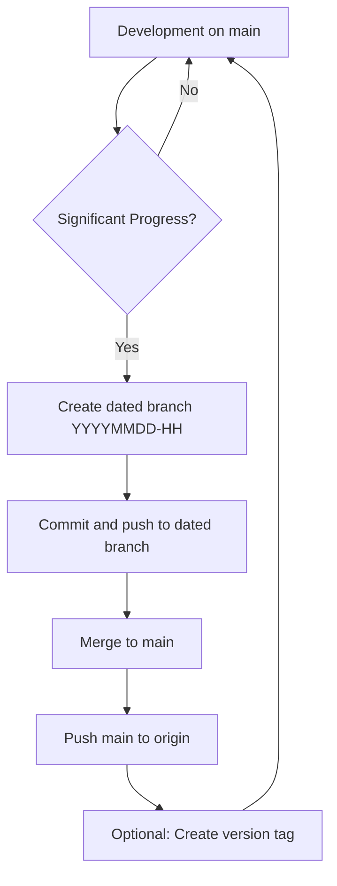

# GitHub Versioning Strategy

## Overview
Structured approach for managing code versions during significant development milestones.

## Versioning Workflow

### 1. Development Phase
- **Branch**: `main`
- **Purpose**: Active development
- **Activity**: All new features and improvements

### 2. Staging/Snapshot Creation
When significant progress is made:

```bash
# Create dated branch as snapshot
git checkout -b "YYYYMMDD-HH"  # Format: 20250814-09

# Example:
git checkout -b "20250814-09"  # August 14, 2025, 9 AM
```

### 3. Push Strategy
```bash
# 1. First, push to dated branch (staging/snapshot)
git add -A
git commit -m "feat: describe the significant progress"
git push -u origin "20250814-09"

# 2. Then, update main with latest code
git checkout main
git merge "20250814-09"
git push origin main

# 3. Create version tag (optional)
git tag -a "v1.0.0-description" -m "Milestone description"
git push origin "v1.0.0-description"
```

## Branch Naming Convention

### Dated Branches (Snapshots)
Format: `YYYYMMDD-HH`
- `YYYY`: Year (4 digits)
- `MM`: Month (2 digits)
- `DD`: Day (2 digits)
- `HH`: Hour in 24-hour format (2 digits)

Examples:
- `20250814-09`: August 14, 2025, 9 AM
- `20250815-14`: August 15, 2025, 2 PM
- `20250820-23`: August 20, 2025, 11 PM

### Version Tags
Format: `v{MAJOR}.{MINOR}.{PATCH}-{description}`

Examples:
- `v1.0.0-performance`: Performance optimization milestone
- `v1.1.0-compliance`: Compliance features added
- `v2.0.0-redesign`: Major architecture redesign

## Workflow Diagram



## Command Sequence Template

```bash
# When told to "create branch as staging"
BRANCH_NAME=$(date "+%Y%m%d-%H")

# Step 1: Create and push staging branch
git checkout -b "$BRANCH_NAME"
git add -A
git commit -m "feat: [description of progress]

- [Key achievement 1]
- [Key achievement 2]
- [Performance metrics]

Co-Authored-By: Claude <noreply@anthropic.com>"
git push -u origin "$BRANCH_NAME"

# Step 2: Update main branch
git checkout main
git merge "$BRANCH_NAME"
git push origin main

# Step 3: Create version tag (if milestone)
git tag -a "v1.x.x-keyword" -m "Description"
git push origin "v1.x.x-keyword"
```

## Purpose of Each Branch Type

### Main Branch
- **Purpose**: Latest stable code
- **Audience**: Active development
- **Updates**: Continuous
- **Protection**: Optional branch protection rules

### Dated Branches (Staging/Snapshots)
- **Purpose**: Historical snapshots of significant progress
- **Audience**: Reference and rollback points
- **Updates**: Never (immutable snapshots)
- **Retention**: Keep indefinitely or based on policy

### Version Tags
- **Purpose**: Release milestones
- **Audience**: Deployment and releases
- **Updates**: Never (immutable)
- **Usage**: Production deployments

## Best Practices

1. **Commit Messages**
   - Use conventional commits (feat, fix, docs, etc.)
   - Include performance metrics when relevant
   - Reference issue numbers if applicable

2. **Branch Hygiene**
   - Keep main branch deployable
   - Don't modify dated branches after creation
   - Use pull requests for code review (optional)

3. **Documentation**
   - Update README with significant changes
   - Document performance improvements
   - Maintain CHANGELOG.md

## Example History

```bash
* 1434a93 (HEAD -> main, origin/main, tag: v1.0.0-performance, origin/20250814-09, 20250814-09) 
          feat: implement ultra-performance journal processing system
* c4d7be2 Add comprehensive README documentation
* ff9ff5a Initial commit: Complete journal system analysis
```

## Recovery Scenarios

### Rollback to Snapshot
```bash
# If something goes wrong, rollback to snapshot
git checkout 20250814-09
git checkout -b main-recovery
git push -f origin main-recovery:main  # Force only in emergency
```

### Cherry-pick from Snapshot
```bash
# Take specific commits from snapshot
git cherry-pick <commit-hash>
```

## Benefits of This Strategy

1. **Traceability**: Clear history of significant milestones
2. **Safety**: Easy rollback to known good states
3. **Clarity**: Dated branches show progression over time
4. **Flexibility**: Can reference any snapshot
5. **Compliance**: Audit trail for changes

## Notes

- Dated branches are immutable snapshots
- Main branch always has the latest code
- Tags mark production-ready releases
- This strategy supports both rapid development and stability