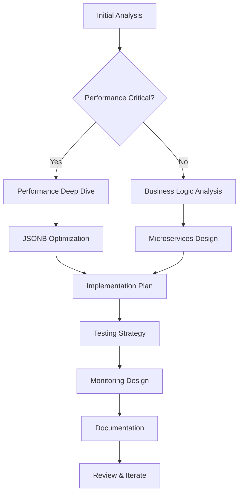

# Quick Reference Guide for System Analysis Prompts

## 🚀 Quick Start Checklist

### Prerequisites
- [ ] Database access credentials
- [ ] Function name to analyze
- [ ] Understanding of business domain
- [ ] Performance baseline metrics
- [ ] Compliance requirements list

### Initial Setup Commands
```bash
# Create project structure
mkdir -p fns tbls plans prompts

# Extract main function
psql -U postgres -d database -c "\sf fn_insert_sun_journal" > fns/main_function.sql

# List all functions
psql -U postgres -d database -c "\df fn_*" > fns/function_list.txt

# Export schema
pg_dump -U postgres -d database --schema-only > schema_backup.sql
```

## 📋 Prompt Selection Matrix

| Scenario | Primary Prompt | Follow-up Prompts | Expected Timeline |
|----------|---------------|-------------------|-------------------|
| Complete System Overhaul | Initial Analysis | All follow-ups | 3-6 months |
| Performance Issues | Initial Analysis | Performance Deep Dive + JSONB Optimization | 1-2 months |
| Compliance Audit | Initial Analysis | Security Hardening + Regulatory Reporting | 2-3 months |
| Cloud Migration | Initial Analysis | Cloud Migration + Microservices | 4-6 months |
| Quick Wins Needed | Performance Deep Dive | Database Optimization | 2-4 weeks |
| Insurance Modernization | Initial Analysis | Insurance Product + Unit Link + Reinsurance | 3-4 months |

## 🎯 Analysis Depth Levels

### Level 1: Rapid Assessment (1-2 days)
```
Focus: Quick identification of critical issues
Prompts: 
- Performance Deep Dive (sections 1-2 only)
- Current system bottleneck identification
Output: Top 10 issues list with quick fixes
```

### Level 2: Standard Analysis (1-2 weeks)
```
Focus: Comprehensive current state analysis
Prompts:
- Initial Analysis (complete)
- Performance Deep Dive
- Data Quality Assessment
Output: Full documentation + 3 enhancement strategies
```

### Level 3: Deep Transformation (2-4 weeks)
```
Focus: Complete modernization blueprint
Prompts:
- Initial Analysis (complete)
- All relevant follow-ups
- All specialized prompts
Output: 6+ strategies + implementation roadmap
```

## 🔄 Iterative Analysis Workflow



## 💡 Prompt Combination Patterns

### Pattern 1: Performance-First Modernization
```
1. Performance Deep Dive
2. JSONB Optimization Specialist
3. Enhanced PostgreSQL Strategy
4. Testing Strategy
= Optimized system with minimal changes
```

### Pattern 2: Cloud-Native Transformation
```
1. Initial Analysis
2. Microservice Decomposition
3. Cloud Migration Strategy
4. API Gateway Design
5. Monitoring Design
= Modern cloud-native architecture
```

### Pattern 3: Compliance-Driven Enhancement
```
1. Initial Analysis
2. Security and Compliance Hardening
3. Data Quality Framework
4. Regulatory Reporting Specialist
5. Audit Trail Enhancement
= Compliance-ready system
```

### Pattern 4: Event-Driven Architecture
```
1. Initial Analysis
2. Event Sourcing Design
3. CQRS Implementation
4. Stream Processing Migration
5. Event Mesh Design
= Event-driven reactive system
```

## 🛠️ Tool Integration Commands

### PostgreSQL Analysis
```sql
-- Find slow queries
SELECT query, calls, mean_time, total_time
FROM pg_stat_statements
WHERE query LIKE '%fn_insert%'
ORDER BY mean_time DESC;

-- Table sizes
SELECT schemaname, tablename, 
       pg_size_pretty(pg_total_relation_size(schemaname||'.'||tablename)) as size
FROM pg_tables
ORDER BY pg_total_relation_size(schemaname||'.'||tablename) DESC;

-- Index usage
SELECT schemaname, tablename, indexname, idx_scan
FROM pg_stat_user_indexes
ORDER BY idx_scan;
```

### Function Dependency Analysis
```sql
-- Find all functions called by a function
WITH RECURSIVE function_tree AS (
    SELECT proname, prosrc, 0 as level
    FROM pg_proc
    WHERE proname = 'fn_insert_sun_journal'
    
    UNION ALL
    
    SELECT p.proname, p.prosrc, ft.level + 1
    FROM pg_proc p
    JOIN function_tree ft ON ft.prosrc LIKE '%' || p.proname || '%'
    WHERE ft.level < 3
)
SELECT DISTINCT proname, level
FROM function_tree
ORDER BY level, proname;
```

## 📊 Success Metrics Template

### Performance Metrics
- [ ] Query execution time < 100ms
- [ ] Batch processing < 5 minutes for 100k records
- [ ] API response time < 200ms p95
- [ ] Database CPU < 70% utilization

### Quality Metrics
- [ ] Code coverage > 80%
- [ ] Data quality score > 95%
- [ ] Zero critical security vulnerabilities
- [ ] 100% regulatory compliance

### Business Metrics
- [ ] Processing accuracy > 99.99%
- [ ] System availability > 99.9%
- [ ] Audit trail completeness 100%
- [ ] User satisfaction > 4.5/5

## 🚨 Red Flags to Watch For

### In Current System
- String concatenation for JSON building
- Loops with database queries
- Missing indexes on JOIN columns
- No error handling in functions
- Hardcoded business rules
- No transaction boundaries

### In Proposed Solutions
- Over-engineering for current needs
- Ignoring team skill gaps
- Unrealistic timelines
- Missing migration strategy
- No rollback plan
- Inadequate testing approach

## 📝 Output Template Structure

```markdown
# System Analysis Report

## Executive Summary
- Current State Assessment
- Key Findings
- Recommended Approach
- Expected Benefits

## Detailed Analysis
### 1. Current System
- Architecture
- Performance Metrics
- Pain Points
- Technical Debt

### 2. Business Logic
- Core Processes
- Business Rules
- Compliance Requirements
- Audit Needs

### 3. Enhancement Strategies
#### Strategy 1: [Name]
- Description
- Technology Stack
- Implementation Plan
- Risk Assessment
- Cost-Benefit Analysis

[Repeat for each strategy]

### 4. Recommendation
- Chosen Strategy Justification
- Implementation Roadmap
- Success Criteria
- Risk Mitigation

## Appendices
- A. Function Documentation
- B. Database Schema
- C. Performance Benchmarks
- D. Compliance Matrix
```

## 🔗 Useful Resources

### Documentation Standards
- [OpenAPI Specification](https://swagger.io/specification/)
- [AsyncAPI for Event-Driven](https://www.asyncapi.com/)
- [C4 Model for Architecture](https://c4model.com/)
- [ADR Template](https://adr.github.io/)

### Technology References
- [PostgreSQL Performance](https://wiki.postgresql.org/wiki/Performance_Optimization)
- [JSONB Best Practices](https://www.postgresql.org/docs/current/datatype-json.html)
- [Microservices Patterns](https://microservices.io/patterns/)
- [Event Sourcing](https://martinfowler.com/eaaDev/EventSourcing.html)

## 🎓 Learning Path

### For Beginners
1. Start with Performance Deep Dive
2. Move to Data Quality Enhancement
3. Progress to Testing Strategy

### For Intermediate
1. Complete Initial Analysis
2. Choose 2-3 specialized prompts
3. Design implementation roadmap

### For Advanced
1. All prompts in sequence
2. Create custom prompt combinations
3. Design novel architecture patterns

## 💬 Prompt Engineering Tips

### DO's
- ✅ Be specific about constraints
- ✅ Include actual table/function names
- ✅ Specify expected output format
- ✅ Set clear success criteria
- ✅ Include domain context

### DON'Ts
- ❌ Use vague requirements
- ❌ Skip prerequisite analysis
- ❌ Ignore team capabilities
- ❌ Forget about migration
- ❌ Overlook testing needs

## 🔄 Continuous Improvement Loop

```
Analyze → Implement → Measure → Learn → Adjust
   ↑                                        ↓
   ←────────────────────────────────────────
```

1. **Analyze**: Use prompts to understand system
2. **Implement**: Execute chosen strategy
3. **Measure**: Track success metrics
4. **Learn**: Document lessons learned
5. **Adjust**: Refine approach based on results
6. **Repeat**: Continue improvement cycle

## 📞 When to Escalate

### Technical Escalation Triggers
- Performance degradation > 50%
- Data loss risk identified
- Security vulnerability discovered
- Compliance violation detected

### Business Escalation Triggers
- Budget overrun > 20%
- Timeline delay > 1 month
- Scope change > 30%
- Team capability gap identified

## 🎯 Final Checklist

Before starting analysis:
- [ ] Clear project objectives defined
- [ ] Stakeholders identified and engaged
- [ ] Budget and timeline approved
- [ ] Team skills assessed
- [ ] Risk register created

After completing analysis:
- [ ] All findings documented
- [ ] Strategies evaluated objectively
- [ ] Recommendation justified with data
- [ ] Implementation plan realistic
- [ ] Success criteria measurable

Before implementation:
- [ ] Architecture review completed
- [ ] Security review passed
- [ ] Testing strategy approved
- [ ] Rollback plan documented
- [ ] Team trained and ready